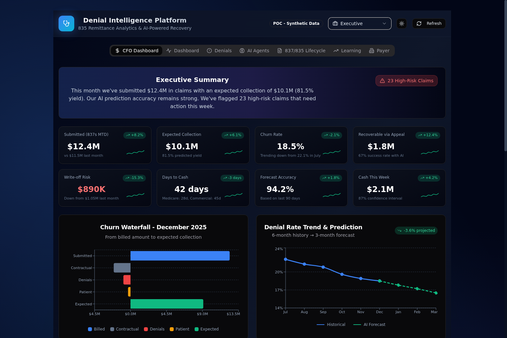
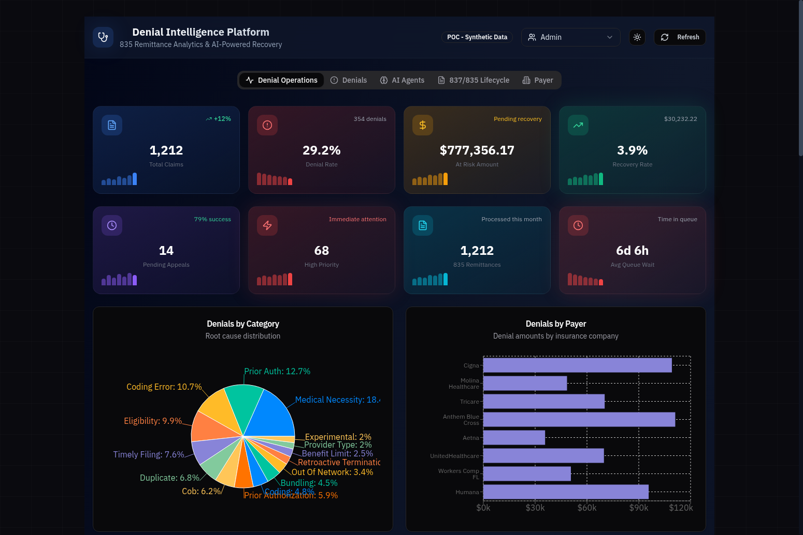
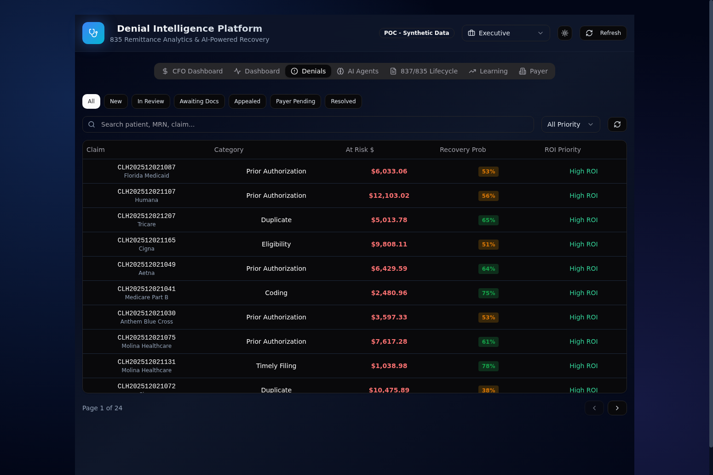
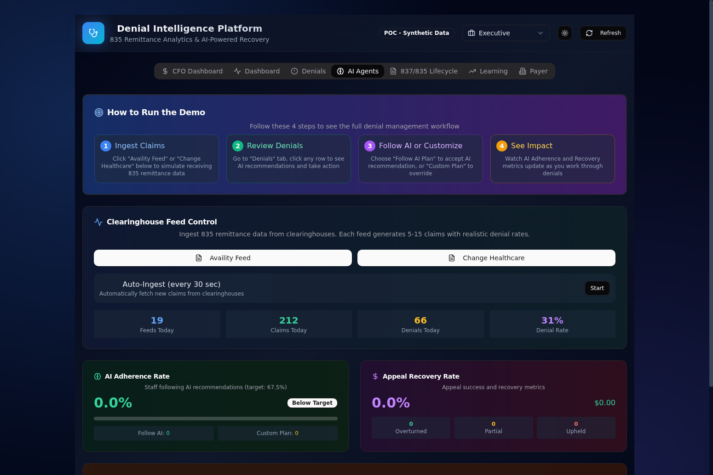
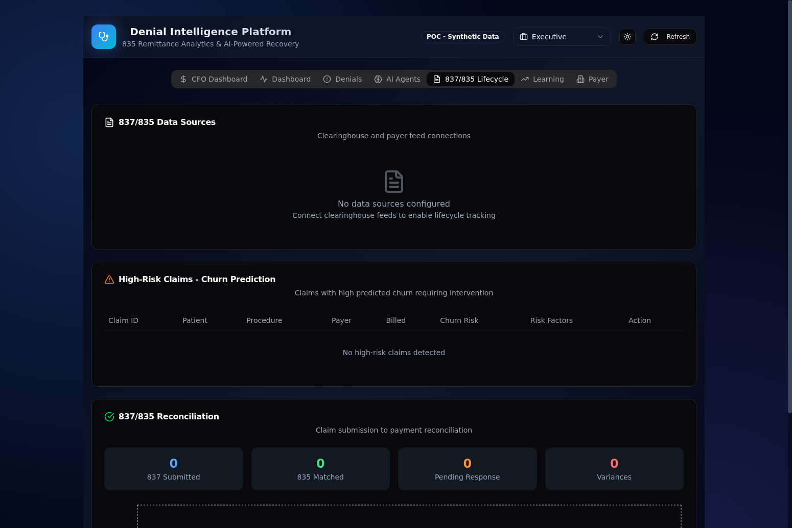

# Denial Intelligence Platform (835 Remittance Analytics)

A comprehensive healthcare denial management POC built with React, FastAPI, and Azure AI agents. This platform helps healthcare organizations reduce revenue leakage through AI-powered denial prediction, churn analysis, and streamlined recovery workflows.

**Primary Focus: 835 Remittance Data & CFO Financial Intelligence**

This POC is designed around 835 ERA (Electronic Remittance Advice) data - the standardized format payers use to communicate claim adjudication results. The platform provides both operational denial management and executive-level financial forecasting with AI-powered predictions.

---

## 💰 Value Summary

| Metric | Impact |
|--------|--------|
| **Revenue Recovery** | +45% higher recovery with AI recommendations |
| **Resolution Time** | 58% faster (4.2 days vs 10.5 days) |
| **Appeal Success Rate** | 2.2x higher (67.5% vs 30.6%) |
| **Staff Satisfaction** | 2.15x higher (4.3/5 vs 2.0/5) |
| **Forecast Accuracy** | 94.2% prediction accuracy |
| **Agent Coverage** | 40 specialized AI agents |
| **Test Pass Rate** | 93.7% (1873/2000 comprehensive tests) |

**Key Capabilities:**
- 🔍 **Early Warning System**: 277CA/277 status intelligence detects issues before denials hit 835
- 📊 **CFO Dashboard**: 8 executive KPIs with 90-day cash forecasting
- 🤖 **40 AI Agents**: Diversified model allocation (o3, gpt-4.1, gpt-4.1-mini, gpt-4.1-nano, DeepSeek-V3)
- ⚡ **Intelligent Routing**: Automatic model selection based on task complexity
- ✅ **Audit & Validation**: Out-of-band consistency checks across all agent outputs

---

## Key Features

### CFO Dashboard (Executive View)

The CFO Dashboard provides comprehensive financial intelligence for healthcare executives with real-time KPIs, predictive analytics, and scenario modeling.

**8 Executive KPI Cards with Sparklines:**
- **Submitted (837s MTD)**: $12.4M (+8.2% vs last month)
- **Expected Collection**: $10.1M (81.5% predicted yield)
- **Churn Rate**: 18.5% (trending down from 22.1% in July)
- **Recoverable via Appeal**: $1.8M (67% success rate with AI)
- **Write-off Risk**: $890K (down from $1.05M last month)
- **Days to Cash**: 42 days (Medicare: 28d, Commercial: 45d)
- **Forecast Accuracy**: 94.2% (based on last 90 days)
- **Cash This Week**: $2.1M (87% confidence interval)

**Churn Waterfall Analysis:**
Visual flow from Submitted ($12.4M) through Contractual adjustments (-$2.1M), Denials (-$890K), Patient responsibility (-$310K) to Expected collection ($9.1M).

**Denial Rate Trend & Prediction:**
6-month historical trend with 3-month AI forecast showing projected -3.6% improvement (from 18.5% to 16.5% by March).

**90-Day Cash Forecast:**
Area chart with confidence bands showing Expected: $29.4M with range $26.8M - $32.1M at 85% confidence.

**Payer Churn Trends (ContosoHealth Payers):**
| Payer | Current Churn | Trend | Forecast |
|-------|---------------|-------|----------|
| Medicare | 8% | Improving | 7.5% |
| BCBS FL | 28% | Worsening | 31% |
| United | 17% | Improving | 15% |
| Aetna | 32% | Worsening | 35% |
| Cigna | 21% | Stable | 21% |
| Humana | 19% | Improving | 18% |

**Q1 Budget vs Trend Forecast:**
Monthly breakdown with variance and confidence percentages for Dec 2025 through Mar 2026, showing Q1 Total: $41.7M budget vs $40.4M forecast (-$1.3M variance, 84% confidence).

**What-If Scenario Modeler:**
Interactive sliders for modeling financial impact:
- Denial Rate: 10% - 25% (current: 18.5%)
- Appeal Success Rate: 30% - 85% (current: 67%)
- Shows Q1 Impact, Annual Impact, and ROI calculations

**High-Risk Claims Section:**
Top 3 claims requiring immediate action with risk scores, confidence levels, deadlines, and AI-detected patterns.

**AI Trend Analysis Banner:**
Contextual insights like "BCBS Florida is trending negative (+6% denial rate) - the model detects a policy change in their prior auth requirements. Recommend scheduling a payer meeting within 2 weeks."

### 837/835 Lifecycle Tracking

Track claims from submission (837) through payment/denial (835) with full reconciliation:

**Data Sources:**
- Availity Clearinghouse
- Change Healthcare
- Direct Payer Connections

**High-Risk Claims Monitoring:**
Real-time tracking of claims at risk of denial with AI-predicted risk scores and recommended interventions.

**Reconciliation Status:**
Track matched, unmatched, and partially matched claims between 837 submissions and 835 remittances.

### 40 AI Agents (18 Denial + 12 CFO + 8 Status + 2 System)

The platform uses 40 AI agents with diversified Azure OpenAI models for comprehensive analysis, financial forecasting, status intelligence, and multi-model verification.

**18 Denial Management Agents:**

| Agent | Model | Purpose |
|-------|-------|---------|
| Recovery Predictor | o3 | Predicts appeal success probability |
| Root Cause Analyzer | o3 | Identifies denial root causes |
| SDOH Scorer | gpt-4.1 | Assesses social determinants of health |
| Care Gap Detector | gpt-4.1 | Identifies gaps in patient care |
| Clinical Urgency | gpt-4.1 | Scores time-sensitivity of cases |
| Financial Value | gpt-4.1-mini | Calculates financial impact |
| Denial Risk Predictor | gpt-4.1-mini | Predicts denial risk factors |
| Doc Completeness | gpt-4.1-mini | Checks documentation completeness |
| Queue Wait Time | gpt-4.1-nano | Estimates processing time |
| Policy Monitor | gpt-4.1-nano | Monitors payer policy changes |
| P2P Optimizer | DeepSeek-V3 | Optimizes peer-to-peer reviews |
| Staff Feedback Processor | DeepSeek-V3 | Processes staff feedback for RL |
| Safety Validator | o1 | Cross-checks clinical decisions |
| Consensus Checker | gpt-4.1 | Detects contradictions between agents |
| Policy Match Grader | DeepSeek | Grades policy compliance 0-100 |
| Viability Scorer | o3 | Grades recommendation viability |
| Eligibility Verifier | gpt-4.1-mini | Real-time eligibility verification |
| Follow-up Scheduler | gpt-4.1-nano | Automated follow-up planning |

**12 Churn Prediction & CFO Intelligence Agents:**

| Agent | Model | Purpose |
|-------|-------|---------|
| Churn Rate Predictor | o3 | Predicts payer-specific churn rates |
| Cash Flow Forecaster | gpt-4.1 | 90-day cash flow predictions |
| Budget Variance Analyzer | gpt-4.1 | Budget vs actual analysis |
| Payer Trend Analyzer | gpt-4.1-mini | Identifies payer behavior patterns |
| Scenario Modeler | o3 | What-if financial modeling |
| Risk Aggregator | gpt-4.1 | Aggregates risk across claims |
| Collection Optimizer | gpt-4.1-mini | Optimizes collection strategies |
| Write-off Predictor | gpt-4.1-mini | Predicts write-off risk |
| Days-to-Cash Analyzer | gpt-4.1-nano | Analyzes payment timing |
| Forecast Accuracy Tracker | gpt-4.1-nano | Monitors prediction accuracy |
| Executive Summary Generator | o3 | Generates executive briefings |
| Trend Anomaly Detector | DeepSeek-V3 | Detects unusual patterns |

**8 Status Intelligence Agents (277/277CA Processing):**

| Agent | Model | Purpose |
|-------|-------|---------|
| Front-End Rejection Analyzer | o3 | Analyzes 277CA front-end rejections |
| Appeal Deadline Risk Assessor | o3 | Prioritizes appeals by deadline risk |
| Pending Claim Risk Scorer | gpt-4.1 | Scores denial risk for pending claims |
| Aging Trend Forecaster | gpt-4.1 | Forecasts A/R aging trends |
| Payer SLA Monitor | gpt-4.1-mini | Monitors payer SLA compliance |
| COB Coordination Analyzer | gpt-4.1-mini | Analyzes COB coordination issues |
| Status Pattern Detector | DeepSeek-V3 | Detects status flow anomalies |
| Status Intelligence Summarizer | gpt-4.1-nano | Summarizes status intelligence |

**2 System Agents (Audit & Health):**

| Agent | Model | Purpose |
|-------|-------|---------|
| Audit Agent | o3 | Out-of-band consistency validation |
| Health Check Agent | gpt-4.1-mini | Monitors agent health/performance |

### High-Denial CPT Codes (ContosoHealth Focus)

The platform includes realistic high-denial scenarios based on ContosoHealth's actual payer mix:

| CPT Code | Description | Avg Denial Rate | Avg Amount | Primary Payers |
|----------|-------------|-----------------|------------|----------------|
| J9271 | Keytruda (Pembrolizumab) | 35% | $45,000 | BCBS FL, Aetna |
| 27447 | Total Knee Arthroplasty | 28% | $28,000 | Medicare, United |
| 70553 | MRI Brain w/wo Contrast | 42% | $2,800 | Cigna, Humana |
| 99213 | Office Visit (Est. Patient, Level 3) | 12% | $150 | All Payers |
| 43239 | Upper GI Endoscopy w/ Biopsy | 25% | $3,500 | BCBS FL, Cigna |
| 93000 | Electrocardiogram (ECG/EKG) | 18% | $85 | Medicare, Humana |

### Comprehensive CPT Code Reference

The test suite validates agent performance across diverse procedure categories:

| Category | CPT Range | Example Codes | Denial Risk |
|----------|-----------|---------------|-------------|
| **Evaluation & Management** | 99201-99499 | 99213, 99214, 99215 | Low-Medium |
| **Surgery - Musculoskeletal** | 20000-29999 | 27447 (TKA), 27130 (THA) | High |
| **Radiology - Diagnostic** | 70000-79999 | 70553 (MRI), 71046 (Chest X-ray) | Medium-High |
| **Medicine - Cardiology** | 93000-93799 | 93000 (ECG), 93306 (Echo) | Low-Medium |
| **Medicine - GI** | 43200-43289 | 43239 (EGD w/ biopsy) | Medium |
| **Drugs - Oncology** | J9000-J9999 | J9271 (Keytruda), J9035 (Avastin) | Very High |
| **Drugs - Infusion** | 96360-96549 | 96413 (Chemo admin) | Medium-High |

**Denial Risk Factors by CPT Category:**
- **Very High (>30%)**: Oncology drugs, specialty biologics - require prior auth, medical necessity documentation
- **High (20-30%)**: Major surgeries, advanced imaging - require clinical justification
- **Medium (10-20%)**: Diagnostic procedures, minor surgeries - documentation completeness issues
- **Low (<10%)**: Routine E&M visits, basic labs - typically coding/billing errors

### Live Azure AI Agents During Feed Ingestion

When you click "Availity Feed" or "Change Healthcare", the system calls **live Azure AI agents** to analyze each denial in real-time:

**Background Task Architecture:**
- Feed ingestion returns immediately with `status: "ai_running"` while AI processes in background
- Avoids HTTP timeouts by running AI analysis asynchronously
- Each denial is analyzed by all 18 denial management agents
- Results are stored in the database and displayed in the Denials tab

**Retry Logic with Exponential Backoff:**
- 3 retry attempts for each AI agent call
- Exponential backoff delays: 1s, 2s, 4s between retries
- Graceful fallback to simulated responses if all retries fail
- Handles transient Azure OpenAI errors automatically

**8-Step Agentic Workflow Pipeline:**
1. Intake & Normalization - Parse 835 EDI and normalize claim records
2. Eligibility & Coverage - Verify member eligibility and coverage
3. Coding & Modifiers - Validate CPT/ICD codes and modifiers
4. Medical Necessity - Check clinical criteria and medical necessity
5. Timely Filing Check - Verify submission within payer deadlines
6. Documentation Review - Check for missing clinical documentation
7. Appeal Strategy - Determine optimal appeal approach
8. Risk Triage & Routing - Assign risk level and route for action

### Persona-Specific Dashboard Views

**Executive View:**
- CFO Dashboard with financial KPIs and forecasting
- Churn analysis and scenario modeling
- Budget variance tracking
- High-risk claims monitoring

**Clinical (Nurse/Staff) View:**
- Avg Time to Treat: 2.3 days (-1.5 days with AI)
- Quality Score: 94.2% (+3.1% this month)
- Focus on patient outcomes and clinical urgency

**Admin View:**
- Full operational view with all metrics
- Access to all tabs including Payer analytics

### AI-Powered Workflow Acceleration

Staff following AI recommendations achieve significantly better outcomes:

| Metric | With AI | Without AI | Improvement |
|--------|---------|------------|-------------|
| Success Rate | 67.5% | 30.6% | 2.2x higher |
| Resolution Time | 4.2 days | 10.5 days | 58% faster |
| Recovery Amount | 45% higher | baseline | +45% |
| Staff Satisfaction | 4.3/5 | 2.0/5 | 2.15x higher |

## Sample EDI Files

The platform includes sample X12 EDI files for testing and demonstration:

**837P Professional Claim** (`samples/edi/sample_837P_claim.txt`):
Standard professional claim submission format with patient demographics, diagnosis codes, and procedure information.

**835 Payment Remittance** (`samples/edi/sample_835_payment.txt`):
Full payment remittance showing claim adjudication with allowed amounts and payment details.

**835 Denial Remittance** (`samples/edi/sample_835_denial.txt`):
Denial remittance with CARC code CO-197 (Precertification/authorization/notification absent) and RARC code N479.

**835 Partial Denial** (`samples/edi/sample_835_partial_denial.txt`):
Partial payment with some line items denied, demonstrating mixed adjudication scenarios.

**277CA Accepted** (`samples/edi/sample_277CA_accepted.txt`):
Claim acknowledgment showing successful front-end acceptance (A1 status) for processing.

**277CA Rejected** (`samples/edi/sample_277CA_rejected.txt`):
Claim acknowledgment showing front-end rejection (A3 status) with rejection reason T15 (Missing/invalid prior authorization).

**277 Pending** (`samples/edi/sample_277_pending.txt`):
Claim status response showing pending adjudication (A7 status) with payer claim control number.

**277 Finalized** (`samples/edi/sample_277_finalized.txt`):
Claim status response showing finalized processing (A8 status) with payment issued and check reference.

## AI Agent Orchestration & Intelligent Routing

The platform uses **LangGraph** for graph-based agent workflows combined with `AIAgentOrchestrator` for intelligent routing and parallel execution of all 40 agents.

### LangGraph Integration

LangGraph provides stateful, graph-based workflows for complex multi-step agent orchestration:

```python
from app.services.agent_workflows import (
    run_denial_workflow,
    run_status_workflow,
    run_audit_workflow,
    LangGraphOrchestrator
)

orchestrator = LangGraphOrchestrator()
result = await orchestrator.analyze_denial(claim_id, denial_data)
```

**Three Core Workflows:**

| Workflow | Purpose | Agents Used |
|----------|---------|-------------|
| **Denial Analysis** | Full claim denial analysis with validation | 9 agents (SDOH, Care Gap, Clinical, Financial, Recovery, Doc, PA, Safety, Consensus) |
| **Status Intelligence** | 277/277CA processing and risk assessment | 5 agents (Frontend Rejection, Pattern Detector, Pending Risk, Aging, SLA) |
| **Audit** | Out-of-band consistency validation | 1 agent (Audit Agent) |

**Denial Analysis Workflow Flow:**
```
┌─────────────────┐     ┌─────────────────┐     ┌─────────────────┐
│ Patient Context │ ──▶ │    Financial    │ ──▶ │  Documentation  │
│   (parallel)    │     │   (parallel)    │     │   (parallel)    │
│ SDOH, Care Gap, │     │ Financial Value │     │ Doc Complete,   │
│ Clinical Urgency│     │ Recovery Pred.  │     │ PA Risk         │
└─────────────────┘     └─────────────────┘     └─────────────────┘
                                                        │
                              ┌──────────────────────────┘
                              ▼
                    ┌─────────────────┐     ┌─────────────────┐
                    │   Validation    │ ──▶ │   Synthesize    │
                    │   (if >$5000)   │     │ Recommendation  │
                    │ Safety, Consens │     │                 │
                    │ Policy Match    │     │                 │
                    └─────────────────┘     └─────────────────┘
```

### Model Allocation Strategy

Agents are automatically routed to the optimal model based on task complexity:

| Model | Use Case | Agents | Avg Latency |
|-------|----------|--------|-------------|
| **o3** | Complex reasoning, multi-factor analysis | 6 agents | ~2000ms |
| **gpt-4.1** | Standard analysis, balanced performance | 10 agents | ~1500ms |
| **gpt-4.1-mini** | Efficient high-volume tasks | 12 agents | ~900ms |
| **gpt-4.1-nano** | Fast, cost-efficient summaries | 6 agents | ~500ms |
| **DeepSeek-V3** | Specialized pattern detection | 4 agents | ~1200ms |
| **o1** | Safety-critical validation | 2 agents | ~1800ms |

### Orchestration Features

```
┌─────────────────────────────────────────────────────────────────┐
│                    AIAgentOrchestrator                          │
├─────────────────────────────────────────────────────────────────┤
│  ┌─────────────┐  ┌─────────────┐  ┌─────────────┐             │
│  │ AGENT_MODEL │  │   AGENT     │  │  Parallel   │             │
│  │    _MAP     │→ │  REGISTRY   │→ │  Execution  │             │
│  │ (routing)   │  │ (metadata)  │  │  (async)    │             │
│  └─────────────┘  └─────────────┘  └─────────────┘             │
│         │                │                │                     │
│         ▼                ▼                ▼                     │
│  ┌─────────────────────────────────────────────────┐           │
│  │              Validation Layer                    │           │
│  │  ┌──────────┐ ┌──────────┐ ┌──────────────┐    │           │
│  │  │ Safety   │ │Consensus │ │ Policy Match │    │           │
│  │  │Validator │ │ Checker  │ │   Grader     │    │           │
│  │  │  (o1)    │ │(gpt-4.1) │ │ (DeepSeek)   │    │           │
│  │  └──────────┘ └──────────┘ └──────────────┘    │           │
│  └─────────────────────────────────────────────────┘           │
│         │                                                       │
│         ▼                                                       │
│  ┌─────────────────────────────────────────────────┐           │
│  │         Synthesized Recommendations              │           │
│  └─────────────────────────────────────────────────┘           │
└─────────────────────────────────────────────────────────────────┘
```

### Key Orchestration Capabilities

1. **Intelligent Routing**: `AGENT_MODEL_MAP` automatically routes each agent to the appropriate model
2. **Parallel Execution**: Agents run concurrently for faster processing
3. **Multi-Model Validation**: Cross-checks between o1, gpt-4.1, and DeepSeek for life-critical decisions
4. **Agent Registry**: `AGENT_REGISTRY` provides metadata for all 40 agents (ID, name, model, category)
5. **Audit Trail**: `AuditAgent` (SYS-001) validates consistency across all agent outputs
6. **Health Monitoring**: `HealthCheckAgent` (SYS-002) tracks agent performance metrics

### CARC Code Reference (Claim Adjustment Reason Codes)

CARC codes explain why a claim was adjusted or denied. The prefix indicates who is responsible:
- **CO** = Contractual Obligation (provider write-off)
- **PR** = Patient Responsibility (collect from patient)
- **OA** = Other Adjustment
- **PI** = Payer Initiated Reduction

#### Contractual Obligation (CO) Codes - Provider Write-offs

| Code | Plain English Meaning | What Happened | What To Do |
|------|----------------------|---------------|------------|
| **CO-4** | Wrong modifier used | The procedure code doesn't match the modifier you billed | Review modifier guidelines; rebill with correct modifier |
| **CO-5** | Procedure not covered by plan | This service isn't included in the patient's benefits | Check if alternate code is covered; bill patient if appropriate |
| **CO-6** | Procedure not medically necessary | Payer doesn't think this service was needed | Submit medical records showing necessity; appeal with clinical notes |
| **CO-11** | Diagnosis doesn't support procedure | The diagnosis code doesn't justify the procedure | Review ICD-10 coding; rebill with supporting diagnosis |
| **CO-15** | Authorization missing or invalid | Prior auth was required but not obtained or expired | Get retroactive auth if possible; appeal with clinical urgency |
| **CO-16** | Missing information | Claim is incomplete - missing required data | Resubmit with all required fields completed |
| **CO-18** | Duplicate claim | This exact claim was already submitted | Check payment history; don't rebill if already paid |
| **CO-22** | Coordination of Benefits issue | Another insurance should pay first | Bill primary insurance first; then submit to secondary |
| **CO-24** | Charges covered by capitation | Service is included in your capitated contract | No additional payment due - part of cap agreement |
| **CO-27** | Expenses after coverage ended | Service date is after patient's coverage terminated | Verify eligibility before service; bill patient |
| **CO-29** | Filing deadline missed | Claim submitted too late | Appeal with proof of timely filing; check for exceptions |
| **CO-45** | Exceeds fee schedule | Billed amount is higher than contracted rate | Write off difference per contract; this is normal |
| **CO-50** | Non-covered service | This specific service is excluded from coverage | Bill patient; verify coverage before future services |
| **CO-96** | Non-covered charges | General exclusion from benefits | Review policy; bill patient if appropriate |
| **CO-97** | Already paid | Payment was already made for this service | Check EOBs; don't rebill |
| **CO-109** | Not covered by this payer | Wrong insurance billed | Verify correct payer; rebill to correct insurance |
| **CO-119** | Benefit maximum reached | Patient has used all allowed benefits | Bill patient; inform them of benefit limits |
| **CO-167** | Diagnosis not covered | This diagnosis isn't covered under the plan | Review policy; consider alternate diagnosis if appropriate |
| **CO-197** | Prior authorization missing | Service required pre-approval that wasn't obtained | Request retroactive auth; appeal with medical necessity |
| **CO-204** | Service not distinct | This service is bundled with another procedure | Review bundling rules; bill correctly |
| **CO-234** | Not authorized provider | Provider isn't in network or credentialed | Verify credentialing; patient may owe out-of-network costs |
| **CO-242** | Services not rendered by network | Out-of-network provider performed service | Bill at out-of-network rate; patient may owe balance |
| **CO-253** | Sequestration reduction | Automatic Medicare budget cut (2%) | This is standard; no action needed |

#### Patient Responsibility (PR) Codes - Collect from Patient

| Code | Plain English Meaning | What Happened | What To Do |
|------|----------------------|---------------|------------|
| **PR-1** | Deductible | Patient hasn't met their annual deductible | Bill patient for deductible amount |
| **PR-2** | Coinsurance | Patient's share after deductible (e.g., 20%) | Bill patient for coinsurance percentage |
| **PR-3** | Co-payment | Fixed amount patient owes per visit | Collect copay at time of service |
| **PR-26** | Expenses before coverage started | Service was before patient's coverage began | Bill patient; verify eligibility dates |
| **PR-27** | Expenses after coverage ended | Service was after patient's coverage ended | Bill patient; verify eligibility dates |
| **PR-49** | Non-covered - routine exam | Routine/preventive care not covered | Bill patient; explain coverage limits |
| **PR-50** | Non-covered service | Service excluded from patient's plan | Bill patient; explain what's not covered |
| **PR-96** | Non-covered charges | General exclusion | Bill patient for excluded services |
| **PR-100** | Payment made to patient | Payer sent check directly to patient | Collect from patient; they received the money |
| **PR-109** | Not covered by this payer | Patient's plan doesn't cover this | Bill patient or correct insurance |
| **PR-119** | Benefit maximum reached | Patient used all allowed benefits | Bill patient; explain benefit limits |
| **PR-204** | Service not distinct | Bundled service - patient portion | Bill patient for their share of bundled service |

#### Other Adjustment (OA) Codes

| Code | Plain English Meaning | What Happened | What To Do |
|------|----------------------|---------------|------------|
| **OA-23** | Paid by another payer | Primary insurance already paid | Apply payment; bill secondary if applicable |
| **OA-94** | Processed per contract | Adjustment per your agreement | Standard contractual adjustment |
| **OA-121** | Indemnity payment | Lump sum payment made | Apply to patient account |

### RARC Code Reference (Remittance Advice Remark Codes)

RARC codes provide additional explanation for claim adjustments. They supplement CARC codes with more detail.

#### Common RARC Codes with Plain English Explanations

| Code | Plain English Meaning | Additional Context |
|------|----------------------|-------------------|
| **N30** | Missing patient information | Patient name, DOB, or ID is missing or wrong |
| **N56** | Wrong procedure code | The CPT/HCPCS code billed doesn't match the service |
| **N95** | No coverage on service date | Patient wasn't covered when service was provided |
| **N130** | Paper claim required | This claim type must be submitted on paper |
| **N211** | Alert: check other coverage | Patient may have other insurance to bill |
| **N362** | Missing/invalid service date | Date of service is missing or formatted wrong |
| **N381** | Alert: patient may owe | Remaining balance is patient responsibility |
| **N432** | Alert: appeal rights | You have the right to appeal this decision |
| **N479** | Missing prior authorization | Prior auth number wasn't included or is invalid |
| **N522** | Duplicate of previously processed claim | This exact claim was already adjudicated |
| **N527** | Missing/invalid diagnosis pointer | Diagnosis code isn't linked to procedure correctly |
| **N574** | Our records show different information | Payer's data doesn't match what you submitted |
| **N657** | Service date before coverage | Patient's coverage started after this service |
| **N658** | Service date after coverage | Patient's coverage ended before this service |
| **MA01** | Alert: secondary payer | If patient has other insurance, bill them |
| **MA04** | Secondary payment | This is the secondary payer's payment |
| **MA07** | Alert: appeal deadline | Note the deadline to file an appeal |
| **MA13** | Alert: review EOB | Review the Explanation of Benefits for details |
| **MA18** | Alert: patient inquiry | Patient should contact their insurance |
| **MA130** | Outside benefit period | Service was rendered outside coverage dates |

#### RARC Alert Codes (Informational)

| Code | What It Means |
|------|--------------|
| **N432** | You can appeal this decision |
| **N479** | Prior authorization was required but missing |
| **N522** | This is a duplicate claim |
| **MA01** | Bill secondary insurance if applicable |
| **MA07** | Note the appeal filing deadline |
| **MA13** | Review the full EOB for details |
| **MA18** | Patient should call their insurance company |

## Architecture

### Backend (FastAPI + SQLite)

```
backend/
├── app/
│   ├── main.py           # FastAPI app with CORS
│   ├── routes.py         # API endpoints (including CFO endpoints)
│   ├── models.py         # SQLAlchemy models (star schema + CFO tables)
│   ├── schemas.py        # Pydantic schemas
│   ├── database.py       # Database connection with WAL mode
│   ├── seed_data.py      # Synthetic data generator (ContosoHealth payers)
│   └── services/
│       ├── data_service.py   # Data abstraction layer
│       ├── ai_agents.py      # 40 AI agents with Azure OpenAI + orchestration
│       │       └── parsers/       # EDI parsers (835, 277, 277CA)
│       └── feed_generator.py # Clearinghouse feed simulation
└── pyproject.toml        # Poetry dependencies
```

### Frontend (React + TypeScript + Tailwind)

```
dashboard/
├── src/
│   ├── App.tsx           # Main component with all tabs (including CFO Dashboard)
│   ├── main.tsx          # Entry point
│   ├── index.css         # Tailwind + Vision UI styles
│   └── components/ui/    # shadcn/ui components
├── .env                  # API URL configuration
└── package.json          # npm dependencies
```

### Database Schema

**Dimension Tables:**
- dim_patient (500 patients with SDOH scores)
- dim_payer (6 ContosoHealth payers: Medicare, BCBS FL, United, Aetna, Cigna, Humana)
- dim_facility (10 facilities)
- dim_physician (50 physicians)
- dim_procedure (100 procedures including high-denial CPT codes)
- dim_denial_reason (CARC/RARC codes)
- dim_treatment_guideline (treatment guidelines)
- dim_clinical_criteria (clinical criteria)
- dim_documentation_requirement (documentation requirements)

**Fact Tables:**
- fact_claim (1,000+ claims)
- fact_denial (denials with AI enrichment)
- fact_appeal (appeals tracking)
- fact_rl_trace (RL traces for AI impact)
- fact_treatment_guidance_result (AI-generated guidance)

**CFO/Churn Tables:**
- cfo_kpis (executive KPI snapshots)
- churn_waterfall (revenue flow analysis)
- cash_forecast (90-day predictions)
- budget_variance (budget vs actual)
- payer_performance (payer-specific metrics)
- executive_summary (AI-generated summaries)
- scenario_model (what-if scenarios)
- high_risk_claim (flagged claims)

## API Endpoints

### CFO Dashboard
- `GET /api/cfo/kpis` - Executive KPI metrics
- `GET /api/cfo/churn-waterfall` - Revenue flow analysis
- `GET /api/cfo/cash-forecast` - 90-day cash predictions
- `GET /api/cfo/budget-variance` - Budget vs actual
- `GET /api/cfo/payer-performance` - Payer metrics
- `GET /api/cfo/executive-summary` - AI-generated summary

### 837/835 Lifecycle
- `GET /api/lifecycle/sources` - Data source status
- `GET /api/lifecycle/high-risk` - High-risk claims
- `GET /api/lifecycle/reconciliation` - Reconciliation status

### Dashboard
- `GET /api/dashboard/metrics` - KPI metrics
- `GET /api/dashboard/denials-by-category` - Denial distribution
- `GET /api/dashboard/denials-by-payer` - Payer analysis

### Denials
- `GET /api/denials` - List denials with pagination/filtering
- `POST /api/ai/analyze-denial/{id}` - AI analysis (all 18 agents)

### Feed Ingestion
- `POST /api/ingest/feed` - Ingest clearinghouse feed with live AI

### Analytics
- `GET /api/analytics/resolution-trends` - Time-to-resolution trends
- `GET /api/analytics/denial-predictions` - Future denial predictions
- `GET /api/analytics/recovery-forecast` - Revenue recovery forecast
- `GET /api/analytics/ai-impact` - AI vs non-AI comparison

## Local Development

### Backend

```bash
cd backend
poetry install
poetry run fastapi dev app/main.py
```

Backend runs at http://localhost:8000

### Frontend

```bash
cd dashboard
npm install
npm run dev
```

Frontend runs at http://localhost:5173

### Environment Variables

Backend `.env`:
```
AZURE_OPENAI_ENDPOINT=https://your-endpoint.cognitiveservices.azure.com
AZURE_OPENAI_API_KEY=your-api-key
AZURE_OPENAI_API_VERSION=2025-01-01-preview
AZURE_OPENAI_DEPLOYMENT_O3=o3
AZURE_OPENAI_DEPLOYMENT_GPT41=gpt-4.1
AZURE_OPENAI_DEPLOYMENT_GPT41_MINI=gpt-4.1-mini
AZURE_OPENAI_DEPLOYMENT_GPT41_NANO=gpt-4.1-nano
AZURE_OPENAI_DEPLOYMENT_DEEPSEEK=DeepSeek-V3-0324
```

Frontend `.env`:
```
VITE_API_URL=http://localhost:8000
```

## Screenshots

### CFO Dashboard (Executive View)
Executive financial intelligence dashboard with 8 KPI cards, churn waterfall, denial trend prediction, cash forecast, payer trends, budget variance, scenario modeler, and high-risk claims.


### Operations Dashboard
Main dashboard showing denial metrics with gradient KPI cards, sparkline bars, category distribution, payer analysis, and AI impact summary. Features the new visual design with IBM Plex Sans font and dark theme.


### Denials Tab
Denials list with status filters, search, and AI-powered recommendations.


### AI Agents Tab
Shows all 30 AI agents with live feed ingestion and 8-step pipeline visualization.


### 837/835 Lifecycle Tab
Track claims from submission through payment with reconciliation status.


### Payer Analytics Tab
Payer-specific performance metrics and trend analysis.


### Denial Detail Drawer
AI recommendations, missing documentation checklist, and one-click actions.


### Live AI Pipeline Processing
8-step agentic workflow showing real-time AI processing of clearinghouse feeds.


## Technology Stack

- **Frontend**: React 18, TypeScript, Vite, Tailwind CSS, shadcn/ui, Recharts
- **Backend**: FastAPI, SQLAlchemy, SQLite (WAL mode), Pydantic
- **AI**: Azure OpenAI (o3, o1, gpt-4.1, gpt-4.1-mini, gpt-4.1-nano, DeepSeek-V3)
- **Deployment**: Fly.io (backend), Devin Apps (frontend)

## Integration Phases

### Phase 1: 835 Denial Management (Current)
**Data Source:** Clearinghouse ERA feeds (Availity/Change Healthcare)
- 835 remittance data ingestion with CARC/RARC codes
- Denial root cause analysis and categorization
- AI-powered appeal recommendations
- Recovery prediction and prioritization

### Phase 2: CFO Financial Intelligence (Current)
**Data Source:** Aggregated 835 data + financial systems
- Churn rate prediction and trending
- Cash flow forecasting with confidence intervals
- Budget variance analysis
- Scenario modeling for financial planning

### Phase 3: 837/835 Lifecycle Reconciliation (Current)
**Data Source:** 837 submissions + 835 remittances
- End-to-end claim tracking
- Reconciliation status monitoring
- High-risk claim identification
- Proactive intervention recommendations

### Phase 4: Clinical Context Integration (Future)
**Data Source:** Epic FHIR R4 APIs
- Clinical documentation integration
- Medical necessity validation
- Prior authorization automation

## Clearinghouse Integration

The platform integrates with two primary clearinghouses for 835 remittance data ingestion, routing claims based on payer relationships.

### Clearinghouse Architecture

```
                    ┌─────────────────────────────────────────────────────────┐
                    │              Denial Intelligence Platform               │
                    │                                                         │
                    │  ┌─────────────┐              ┌─────────────┐          │
                    │  │   Availity  │              │   Change    │          │
                    │  │    SFTP     │              │  Healthcare │          │
                    │  │   Poller    │              │  REST API   │          │
                    │  └──────┬──────┘              └──────┬──────┘          │
                    │         │                            │                  │
                    │         ▼                            ▼                  │
                    │  ┌─────────────────────────────────────────────┐       │
                    │  │           835 Parser & Normalizer           │       │
                    │  └─────────────────────┬───────────────────────┘       │
                    │                        │                                │
                    │                        ▼                                │
                    │  ┌─────────────────────────────────────────────┐       │
                    │  │         18 AI Agents (Live Azure)           │       │
                    │  └─────────────────────┬───────────────────────┘       │
                    │                        │                                │
                    │                        ▼                                │
                    │  ┌─────────────────────────────────────────────┐       │
                    │  │              SQLite Database                 │       │
                    │  └─────────────────────────────────────────────┘       │
                    └─────────────────────────────────────────────────────────┘
```

### Payer-to-Clearinghouse Routing

| Payer | Clearinghouse | Volume % | Avg Days to Pay | Base Denial Rate | Top CARC |
|-------|---------------|----------|-----------------|------------------|----------|
| Florida Blue | Availity | 22% | 21 days | 18% | 197 (Prior Auth) |
| UnitedHealthcare | Change Healthcare | 18% | 28 days | 24% | 50 (Med Necessity) |
| Medicare | Availity | 16% | 14 days | 8% | 96 (Non-Covered) |
| Humana | Availity | 12% | 24 days | 20% | 16 (Missing Info) |
| Aetna | Change Healthcare | 10% | 30 days | 26% | 50 (Med Necessity) |
| Cigna | Availity | 8% | 25 days | 22% | 197 (Prior Auth) |
| Florida Medicaid | Change Healthcare | 7% | 45 days | 32% | 27 (Coverage) |
| Anthem Blue Cross | Change Healthcare | 4% | 26 days | 20% | 197 (Prior Auth) |
| Tricare | Availity | 2% | 18 days | 11% | 16 (Missing Info) |
| Molina Healthcare | Change Healthcare | 1% | 40 days | 28% | 27 (Coverage) |

### Clearinghouse API Endpoints

**Status Check:**
```bash
GET /api/clearinghouse/status
```
Returns connection status for both clearinghouses (Availity and Change Healthcare).

**Poll Availity (SFTP):**
```bash
POST /api/clearinghouse/availity/poll
```
Simulates polling Availity SFTP for new 835 remittance files. Generates realistic denials for FL Blue, Humana, Cigna, Medicare payers.

**Poll Change Healthcare (REST API):**
```bash
POST /api/clearinghouse/change/poll
```
Simulates polling Change Healthcare API for new 835 remittance data. Generates realistic denials for UHC, Aetna, Anthem, Medicaid payers.

**Batch Simulation:**
```bash
POST /api/clearinghouse/simulate/batch?days=7
```
Generates N days of synthetic clearinghouse traffic based on ContosoHealth's payer mix.

**Submit 837 Claim:**
```bash
POST /api/clearinghouse/submit/837?claim_type=837P&payer_name=Florida%20Blue
```
Simulates submitting an 837 claim to the appropriate clearinghouse based on payer routing.

### Production Integration (Future)

**Availity SFTP Connection:**
```python
# Environment variables required
AVAILITY_SFTP_HOST=sftp.availity.com
AVAILITY_SFTP_PORT=22
AVAILITY_SFTP_USER=your_username
AVAILITY_SFTP_PASS=your_password

# Directory structure
/SendFiles/    # Upload 837 claims
/ReceiveFiles/ # Download 835 remittances
```

**Optum/Change Healthcare REST API:**
```python
# Environment variables required
OPTUM_CLIENT_ID=your_client_id
OPTUM_CLIENT_SECRET=your_client_secret
OPTUM_API_BASE=https://api.optum.com/medicalnetwork

# OAuth 2.0 authentication
POST /oauth/token
GET /claims/v1/remittance
```

### ContosoHealth Facility Configuration

| Facility | NPI | Volume Weight | Primary Clearinghouse |
|----------|-----|---------------|----------------------|
| ContosoHealth Orlando | 1234567890 | 25% | Availity |
| ContosoHealth Tampa | 1234567891 | 15% | Availity |
| ContosoHealth Celebration | 1234567892 | 12% | Availity |
| ContosoHealth Altamonte Springs | 1234567893 | 10% | Availity |
| ContosoHealth Daytona Beach | 1234567894 | 10% | Change Healthcare |
| ContosoHealth Winter Park | 1234567895 | 8% | Availity |
| ContosoHealth Fish Memorial | 1234567896 | 8% | Change Healthcare |
| ContosoHealth Waterman | 1234567897 | 6% | Availity |
| ContosoHealth Ocala | 1234567898 | 4% | Change Healthcare |
| ContosoHealth Palm Coast | 1234567899 | 2% | Availity |

### CARC Code Distribution by Category

| Category | CARC Codes | Percentage |
|----------|------------|------------|
| Prior Authorization | 197, 198, 39 | 28% |
| Medical Necessity | 50, 55, 96 | 24% |
| Coding/Billing Errors | 4, 5, 236 | 18% |
| Eligibility Issues | 27, 31, 32 | 12% |
| Duplicate Claims | 18 | 8% |
| Timely Filing | 29 | 5% |
| Bundling Issues | 97, 234 | 5% |

### Production Timeline

| Week | Milestone |
|------|-----------|
| Week 1 | Availity SFTP credentials, test connection |
| Week 2 | Optum API enrollment, OAuth setup |
| Week 3 | Trading partner agreements, payer ID mapping |
| Week 4 | End-to-end testing with live data |
| Week 5 | Production cutover, monitoring setup |

### What ContosoHealth Needs to Provide

1. **Availity Credentials**: SFTP username/password, trading partner ID
2. **Optum API Access**: Client ID/secret, API subscription
3. **Payer IDs**: Payer-specific identifiers for each contracted payer
4. **Facility NPIs**: National Provider Identifiers for each facility
5. **Tax ID (TIN)**: Organization tax identification number
6. **HIPAA BAA**: Business Associate Agreement for PHI handling

## ContosoHealth Payer Configuration

The platform is configured with ContosoHealth's primary payer mix:

| Payer | Type | Clearinghouse | Avg Days to Pay | Denial Rate | Base Yield |
|-------|------|---------------|-----------------|-------------|------------|
| Florida Blue | Commercial | Availity | 21 days | 18% | 78% |
| UnitedHealthcare | Commercial | Change Healthcare | 28 days | 24% | 74% |
| Medicare | Government | Availity | 14 days | 8% | 92% |
| Humana | Commercial | Availity | 24 days | 20% | 76% |
| Aetna | Commercial | Change Healthcare | 30 days | 26% | 72% |
| Cigna | Commercial | Availity | 25 days | 22% | 75% |
| Florida Medicaid | Medicaid | Change Healthcare | 45 days | 32% | 68% |
| Anthem Blue Cross | Commercial | Change Healthcare | 26 days | 20% | 73% |

## License

This is a proof-of-concept application for demonstration purposes.
