# Denial Intelligence Platform (835 Remittance Analytics)

A comprehensive healthcare denial management POC built with React, FastAPI, and Azure AI agents. This platform helps nurses and staff reduce time-to-action on denials through AI-powered recommendations, multi-model validation, and streamlined workflows.

**Primary Focus: 835 Remittance Data (Phase 1)**

This POC is designed around 835 ERA (Electronic Remittance Advice) data - the standardized format payers use to communicate claim adjudication results, including denials with CARC/RARC codes. This is the most accessible and standardized data source for denial management, representing ~80% of the value in revenue cycle optimization.

## Live Demo

- **Frontend**: https://denial-management-app-ljjh74dy.devinapps.com
- **Backend API**: https://app-gaklzyqn.fly.dev

## Key Features

### Persona-Specific Dashboard Views

The platform provides role-optimized views for different user types:

**Clinical (Nurse/Staff) View:**
- **Avg Time to Treat**: Shows average time to get patients treated (2.3 days, -1.5 days with AI)
- **Quality Score**: Patient care quality metrics (94.2%, +3.1% this month)
- Focus on patient outcomes, clinical urgency, and treatment readiness
- Prior Auth tab shows "Can I Treat?" column with YES/NO/PENDING status

**Executive View:**
- **At Risk Amount**: Financial exposure from pending denials ($234,900.23)
- **Recovery Rate**: Revenue recovery performance (14.8%)
- **Training & Enhancement Opportunities**: Top denial categories requiring staff training
  - Shows top 4 denial categories with counts, percentages, and specific training recommendations
  - AI Insight banner with estimated denial reduction from targeted training (15-20%)
- Focus on cost impact, ROI, and strategic improvements

**Admin View:**
- Full operational view with all metrics and tabs
- Access to Payer analytics and Learning tabs

### AI-Powered Workflow Acceleration

The platform demonstrates that staff following AI recommendations achieve significantly better outcomes:

| Metric | With AI | Without AI | Improvement |
|--------|---------|------------|-------------|
| Success Rate | 67.5% | 30.6% | 2.2x higher |
| Resolution Time | 4.2 days | 10.5 days | 58% faster |
| Recovery Amount | 45% higher | baseline | +45% |
| Staff Satisfaction | 4.3/5 | 2.0/5 | 2.15x higher |

### Claims Ingestion Simulator

Simulate new claims being ingested and validated through all 18 AI agents with a real-time progress bar showing each agent's validation status. The simulator demonstrates the full validation pipeline from ingestion to database storage.

### Re-Evaluation Feature

A "Re-run AI Validation" button allows clinicians to re-evaluate existing denials or prior authorizations when:
- Documentation has been updated
- Policy changes have occurred
- Time has passed and fresh analysis is needed
- Before making critical treatment decisions

### Simulate Changes Feature

For demo purposes, a "Simulate Changes" button introduces realistic changes to trigger re-evaluation recommendations:
- Policy updates (payer changed coverage rules)
- Documentation additions (new clinical notes uploaded)
- Patient status changes (new diagnosis, treatment updates)

This creates an "Action Needed" badge indicating re-evaluation is recommended.

### Actionable Detail Drawers

Click any denial or prior auth row to open a detail drawer with:

**For Denials:**
- AI recommended next action with confidence percentage
- Missing documentation checklist from AI agents
- P2P review recommendation with specialist type
- Clinical urgency score and time sensitivity
- SDOH risk assessment
- One-click action buttons (Submit Appeal, Schedule P2P, Request Docs)
- "Follow AI Plan" vs "Custom Plan" tracking for RL
- Activity timeline with appeal deadline
- **AI Appeal Letter Generator** - One-click professional appeal letter generation

**For Prior Authorizations:**
- Denial risk percentage and documentation score
- Procedure details (code, description, request date)
- AI recommendations with pre-submission checklist
- Risk assessment and payer requirements
- Action buttons (Submit PA, Add Clinical Docs, Escalate/Peer Review)
- Timeline with expected decision timeframe
- **"Can I Treat?" Treatment Guidance** - Clear YES/NO/PENDING status with documentation checklist

### 18 AI Agents (12 Specialist + 6 Validation)

The platform uses 18 AI agents with diversified Azure OpenAI models for comprehensive analysis and multi-model verification. This is critical for healthcare decisions where life-and-death accuracy is required.

**12 Specialist Agents:**

| Agent | Model | Purpose |
|-------|-------|---------|
| Recovery Predictor | o3 | Predicts appeal success probability |
| Root Cause Analyzer | o3 | Identifies denial root causes |
| SDOH Scorer | gpt-4.1 | Assesses social determinants of health |
| Care Gap Detector | gpt-4.1 | Identifies gaps in patient care |
| Clinical Urgency | gpt-4.1 | Scores time-sensitivity of cases |
| Financial Value | gpt-4.1-mini | Calculates financial impact |
| PA Risk Predictor | gpt-4.1-mini | Predicts prior auth denial risk |
| Doc Completeness | gpt-4.1-mini | Checks documentation completeness |
| Queue Wait Time | gpt-4.1-nano | Estimates processing time |
| Policy Monitor | gpt-4.1-nano | Monitors payer policy changes |
| P2P Optimizer | DeepSeek-V3 | Optimizes peer-to-peer reviews |
| Staff Feedback Processor | DeepSeek-V3 | Processes staff feedback for RL |

**6 Validation Agents (Multi-Model Verification):**

| Agent | Model | Purpose |
|-------|-------|---------|
| Safety Validator | o1 | Cross-checks clinical decisions, flags life-critical cases |
| Consensus Checker | gpt-4.1 | Detects contradictions between agents |
| Policy Match Grader | DeepSeek | Grades policy compliance 0-100 with letter grade |
| Viability Scorer | o3 | Grades overall recommendation viability 0-100 |
| Eligibility Verifier | gpt-4.1-mini | Real-time eligibility verification |
| Follow-up Scheduler | gpt-4.1-nano | Automated follow-up planning and scheduling |

Each recommendation displays: **Policy Match Grade**, **Viability Grade**, **Safety Status**, and whether **Human Review is Required**.

### User Personas

Three role-based views with different dashboard metrics and tab visibility:

- **Clinical (Nurse/Staff)**: Dashboard (Avg Time to Treat, Quality Score), Prior Auth (Can I Treat?), Denials (Clinical Urgency, SDOH Risk), AI Agents - focused on patient care and treatment readiness
- **Admin**: Dashboard (all metrics), Prior Auth, Denials, AI Agents, Payer - full operational view with financial and clinical data
- **Executive**: Dashboard (At Risk Amount, Recovery Rate, Training & Enhancement Opportunities), AI Agents, Learning, Payer - KPIs, trends, and staff training insights

## Synthetic Dataset

RHAIL-compatible synthetic data for November 2025:

- **1,000 claims** across 500 patients
- **288 denials** (~28.8% denial rate)
- **12 payers** including Medicare, Medicaid, commercial insurers
- **10 facilities** across Florida
- **50 physicians** with various specialties
- **100 procedures** with realistic CPT/HCPCS codes
- **500 RL traces** showing AI impact on outcomes

### Denial Categories

- Medical Necessity (19.8%)
- Prior Authorization (19.8%)
- Coding Errors (11.1%)
- Eligibility (8.3%)
- Timely Filing (6.6%)
- Bundling (6.3%)
- Out of Network (4.5%)
- COB (4.5%)
- Duplicate (4.5%)
- Benefit Limit (4.5%)
- And more...

## Architecture

### Backend (FastAPI + SQLite)

```
backend/
├── app/
│   ├── main.py           # FastAPI app with CORS
│   ├── routes.py         # API endpoints
│   ├── models.py         # SQLAlchemy models (star schema)
│   ├── schemas.py        # Pydantic schemas
│   ├── database.py       # Database connection
│   ├── seed_data.py      # Synthetic data generator
│   └── services/
│       ├── data_service.py   # Data abstraction layer
│       └── ai_agents.py      # 12 AI agents with Azure OpenAI
└── pyproject.toml        # Poetry dependencies
```

### Frontend (React + TypeScript + Tailwind)

```
dashboard/
├── src/
│   ├── App.tsx           # Main component with all tabs
│   ├── main.tsx          # Entry point
│   ├── index.css         # Tailwind + Vision UI styles
│   └── components/ui/    # shadcn/ui components
├── .env                  # API URL configuration
└── package.json          # npm dependencies
```

### Database Schema (Star Schema)

**Dimension Tables:**
- dim_patient (500 patients with SDOH scores)
- dim_payer (12 payers)
- dim_facility (10 facilities)
- dim_physician (50 physicians)
- dim_procedure (100 procedures)
- dim_denial_reason (CARC/RARC codes)
- dim_treatment_guideline (9 treatment guidelines for procedures)
- dim_clinical_criteria (clinical criteria for each guideline)
- dim_documentation_requirement (documentation requirements per guideline)

**Fact Tables:**
- fact_claim (1,000 claims)
- fact_denial (288 denials with AI enrichment)
- fact_prior_auth (200 prior authorizations)
- fact_appeal (appeals tracking)
- fact_rl_trace (500 RL traces for AI impact)
- fact_treatment_guidance_result (AI-generated treatment guidance results)

## API Endpoints

### Dashboard
- `GET /api/dashboard/metrics` - KPI metrics
- `GET /api/dashboard/denials-by-category` - Denial distribution
- `GET /api/dashboard/denials-by-payer` - Payer analysis

### Denials
- `GET /api/denials` - List denials with pagination/filtering
- `POST /api/ai/analyze-denial/{id}` - AI analysis for a denial (all 18 agents)

### Prior Auth
- `GET /api/prior-auths` - List prior authorizations
- `POST /api/ai/analyze-prior-auth/{id}` - AI analysis for a prior auth (all 18 agents)

### Analytics
- `GET /api/analytics/resolution-trends` - Time-to-resolution trends
- `GET /api/analytics/denial-predictions` - Future denial predictions
- `GET /api/analytics/recovery-forecast` - Revenue recovery forecast
- `GET /api/analytics/ai-impact` - AI vs non-AI comparison

### AI Agents
- `GET /api/ai/insights` - AI-generated insights
- `GET /api/ai/agent-status` - Agent status and models

### RL Learning
- `GET /api/rl-traces` - RL trace data
- `GET /api/rl-metrics` - Learning metrics
- `POST /api/rl/feedback` - Submit staff feedback

## Local Development

### Backend

```bash
cd backend
poetry install
poetry run fastapi dev app/main.py
```

Backend runs at http://localhost:8000

### Frontend

```bash
cd dashboard
npm install
npm run dev
```

Frontend runs at http://localhost:5173

### Environment Variables

Backend `.env`:
```
AZURE_OPENAI_ENDPOINT=https://your-endpoint.cognitiveservices.azure.com
AZURE_OPENAI_API_KEY=your-api-key
AZURE_OPENAI_API_VERSION=2025-01-01-preview
# Model deployments
AZURE_OPENAI_DEPLOYMENT_O3=o3
AZURE_OPENAI_DEPLOYMENT_GPT41=gpt-4.1
AZURE_OPENAI_DEPLOYMENT_GPT41_MINI=gpt-4.1-mini
AZURE_OPENAI_DEPLOYMENT_GPT41_NANO=gpt-4.1-nano
AZURE_OPENAI_DEPLOYMENT_DEEPSEEK=DeepSeek-V3-0324
```

Frontend `.env`:
```
VITE_API_URL=http://localhost:8000
```

## Screenshots

### Executive Dashboard with Training Insights
Executive view showing financial metrics and the new "Training & Enhancement Opportunities" section with top denial categories and specific training recommendations.
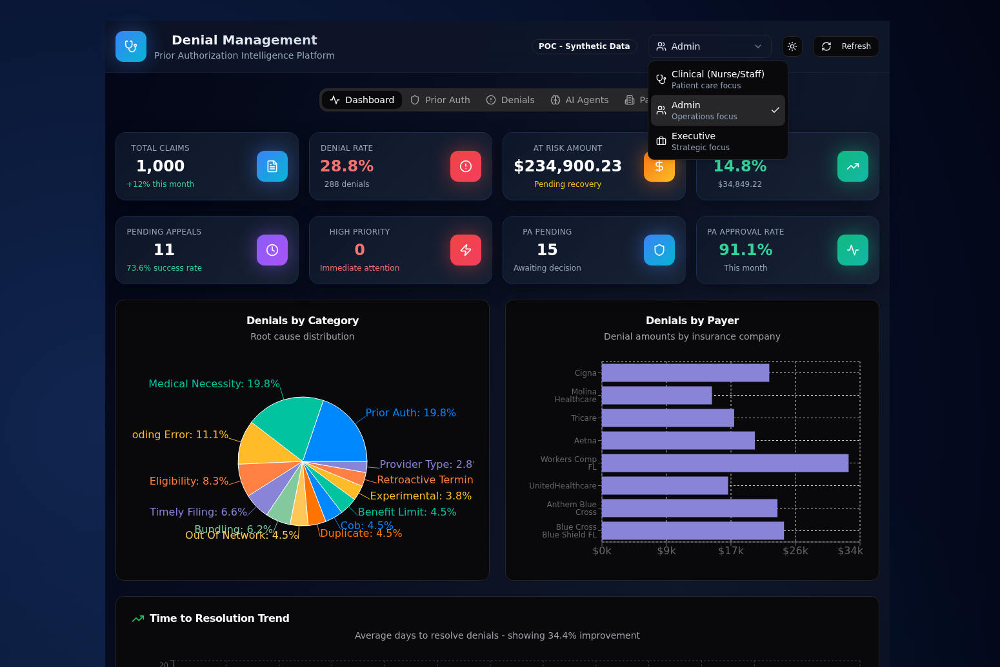

### Clinical Dashboard with Quality Metrics
Clinical (Nurse/Staff) view showing "Avg Time to Treat" and "Quality Score" instead of cost metrics - focused on patient care outcomes.
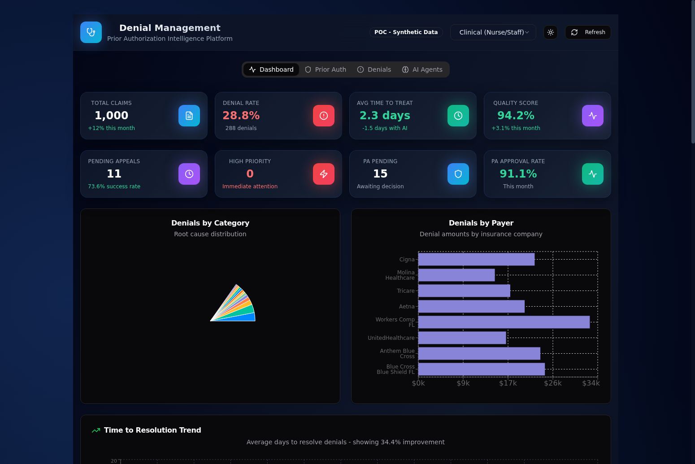

### Prior Auth Tab (Clinical View)
Prior Auth list with "Can I Treat?" column showing YES/NO/PENDING status for each authorization. Includes working filters and search.
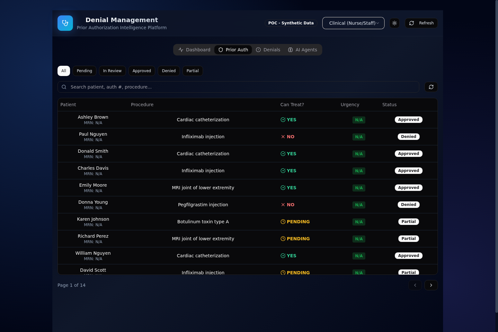

### Denials Tab (Clinical View)
Denials list with Clinical Urgency and SDOH Risk columns. Includes working status filters (All, New, In Review, Awaiting Docs, Appealed, Payer Pending, Resolved) and search.
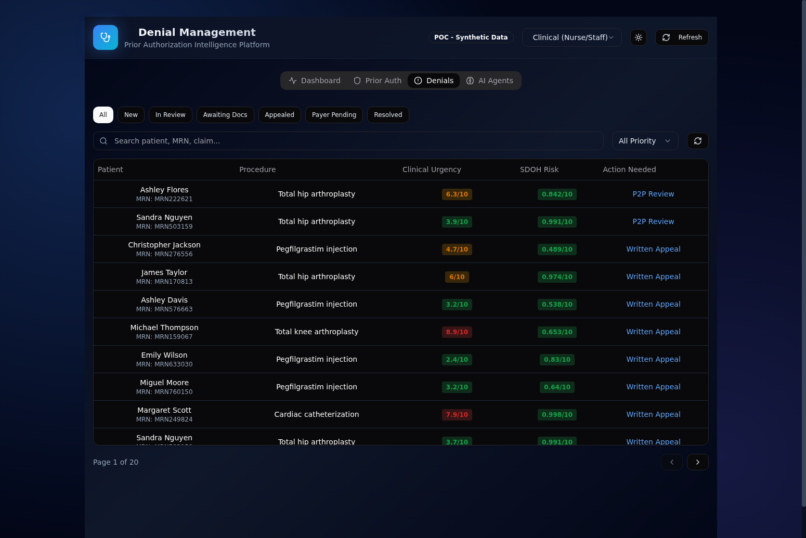

### AI Agents Tab (18 Agents)
Shows all 18 AI agents: 12 Core Agents + 6 Validation Agents using 7 different LLMs. Includes the "Test Ingest" button for simulating new prior auth cases.
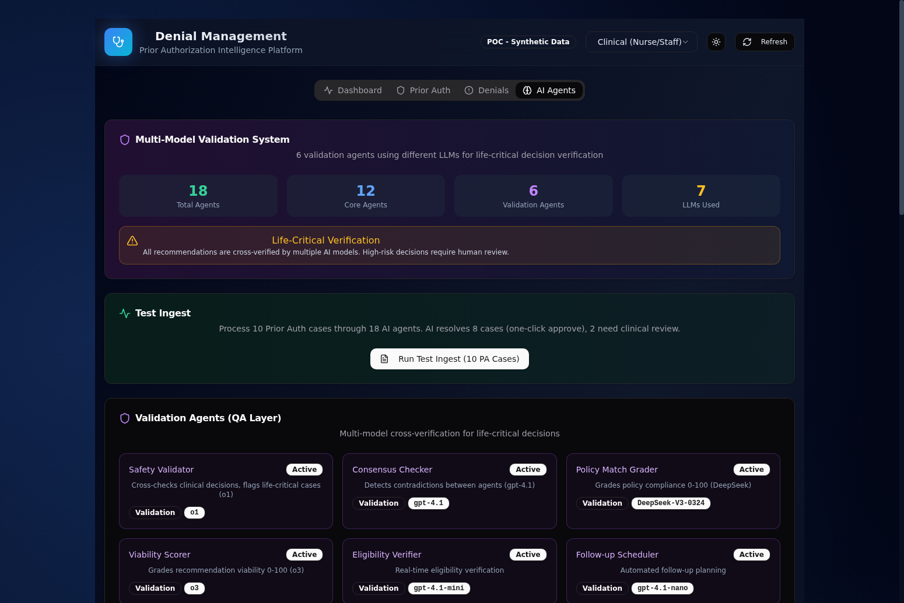

### Denials Workflow Drawer
Detail drawer with AI recommendations, missing documentation checklist, P2P review suggestions, and one-click action buttons.
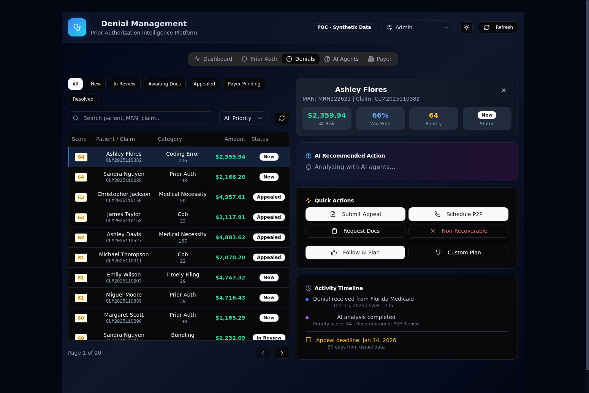

### Denials AI Analysis with Validation Grades
Shows validation grades (Policy Match, Viability, Safety Status) after running all 18 agents on a denial.
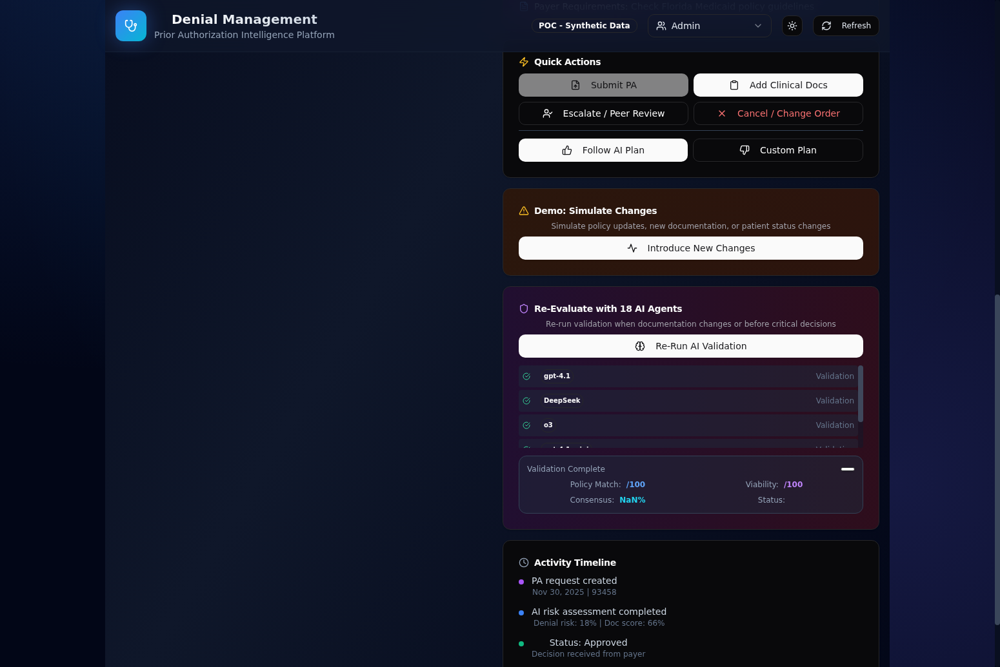

### Prior Auth Workflow Drawer
Detail drawer with "Can I Treat?" guidance, denial risk assessment, documentation checklist, and treatment guidance.
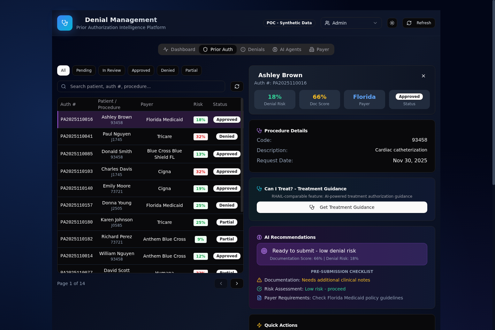

### Test Ingest Feature
Simulates 10 new prior auth cases being processed through all 18 AI agents. Shows AI-resolved queue with one-click approval for low-risk cases.
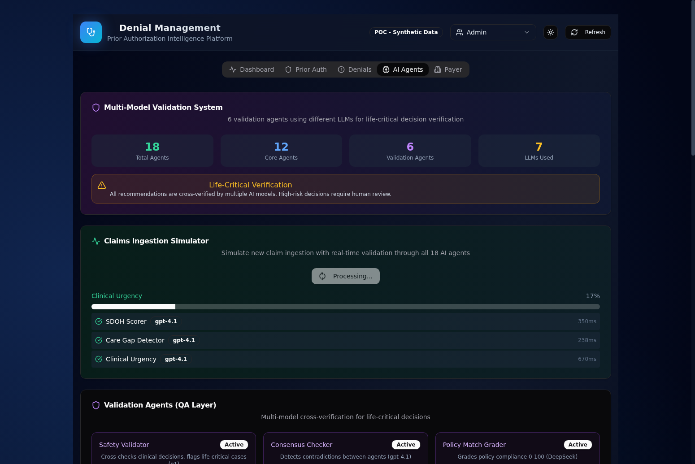

### Re-Evaluation Progress
Progress bar showing each agent analyzing the case, with detected changes and insights displayed instead of model names.
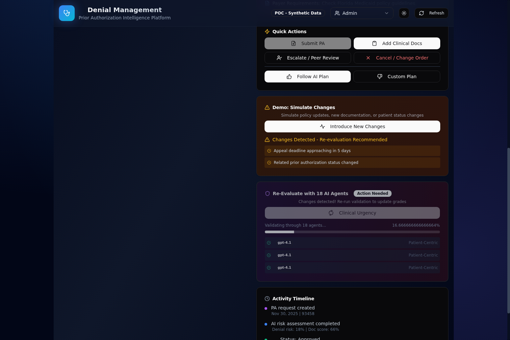

### Simulate Changes Feature
Introduces demo changes (policy updates, new documentation, patient status changes) to trigger re-evaluation recommendations.
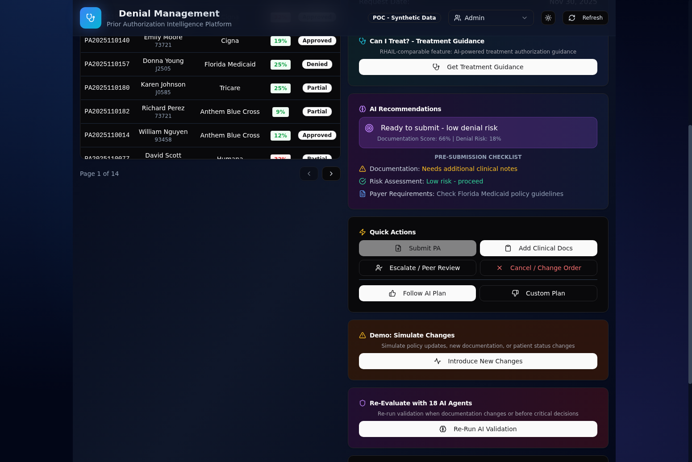

### Action Needed Badge
Yellow "Re-evaluation Recommended" badge appears after changes are detected, prompting staff to re-run AI validation.
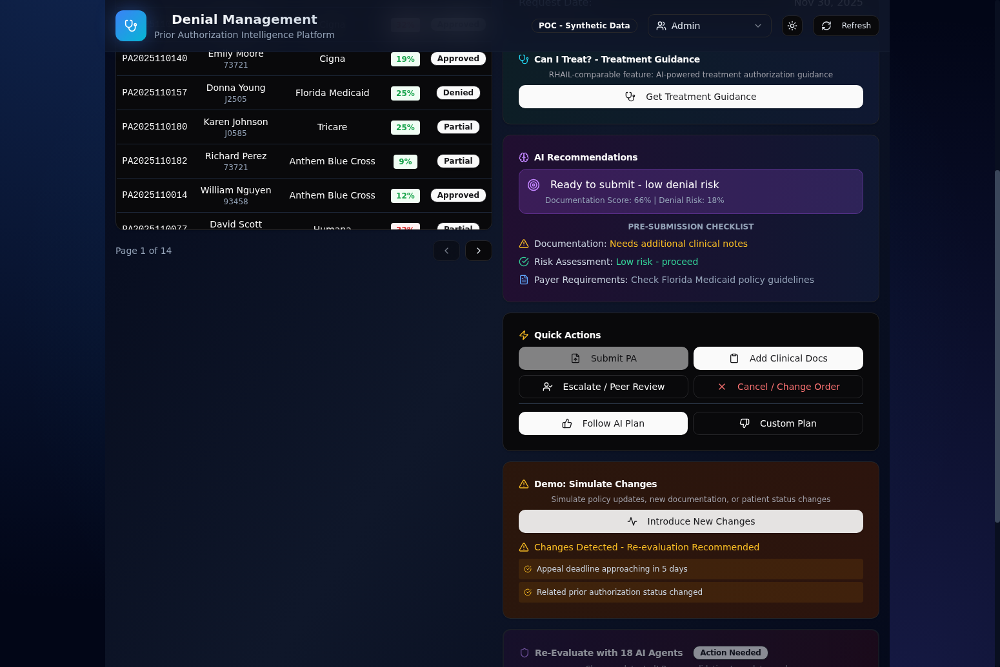

## Technology Stack

- **Frontend**: React 18, TypeScript, Vite, Tailwind CSS, shadcn/ui, Recharts
- **Backend**: FastAPI, SQLAlchemy, SQLite, Pydantic
- **AI**: Azure OpenAI (o3, gpt-4.1, gpt-4.1-mini, gpt-4.1-nano, DeepSeek-V3)
- **Deployment**: Fly.io (backend), Devin Apps (frontend)

## RHAIL Compatibility

This POC implements the data structures and workflows compatible with Microsoft's RHAIL (Revenue Health AI Lab) Claims Denial Navigator:

- Star schema matching Fabric HDS patterns
- CARC/RARC denial codes
- 835/837 claim data structures
- AI agent architecture for denial management
- RL trace collection for continuous improvement

## Integration Phases & Production Roadmap

This POC is designed with a phased integration approach aligned with AdventHealth's production data sources:

### Phase 1: 835 Denial Management (60-90 days) - PRIMARY FOCUS
**Data Source:** Clearinghouse ERA feeds (Availity/Change Healthcare)
**Complexity:** LOW - Standardized EDI format, batch processing

This POC demonstrates Phase 1 capabilities:
- 835 remittance data ingestion with CARC/RARC codes
- Denial root cause analysis and categorization
- AI-powered appeal recommendations
- Recovery prediction and prioritization
- Staff workflow optimization

**POC Entity Mapping:**
| POC Table | Production Source | Key Fields |
|-----------|------------------|------------|
| fact_denial | 835 CAS segment | carc_code, rarc_code, group_code, adjustment_amount |
| fact_claim | 835 CLP segment + 837 context | claim_number, payer_claim_number, billed/allowed/paid amounts |
| dim_denial_reason | CARC/RARC reference tables | denial codes, categories, descriptions |
| dim_payer | Clearinghouse payer IDs | payer identifiers, ERA routing |

### Phase 2: Clinical Context Integration (90-180 days)
**Data Source:** Epic FHIR R4 APIs, Epic Bridges
**Complexity:** MEDIUM - Requires Epic integration

Adds clinical context to denial analysis:
- Patient demographics and clinical history
- Diagnosis codes and procedures from EHR
- Clinical documentation for appeals
- SDOH scores from Z-codes and social history

**POC Entity Mapping:**
| POC Table | Production Source | Key Fields |
|-----------|------------------|------------|
| dim_patient | Epic FHIR Patient resource | demographics, MRN, SDOH indicators |
| dim_procedure | Epic FHIR Procedure resource | CPT/HCPCS codes, descriptions |
| dim_physician | Epic FHIR Practitioner resource | NPI, specialty, credentials |

### Phase 3: Prior Authorization Intelligence (6+ months)
**Data Source:** Payer portals (Availity, direct APIs), Epic PA module, RPA for stragglers
**Complexity:** HIGH - Fragmented, payer-by-payer integration

Real-time prior auth status aggregation:
- Multi-payer PA status tracking
- "Can I Treat?" real-time guidance
- PA denial prediction before submission
- Automated follow-up scheduling

**POC Entity Mapping:**
| POC Table | Production Source | Key Fields |
|-----------|------------------|------------|
| fact_prior_auth | Epic PA module + payer APIs | auth_status, decision_date, denial_probability |
| dim_treatment_guideline | InterQual, MCG, internal P&T | medical necessity criteria |
| fact_treatment_guidance_result | AI evaluation results | can_treat status, missing criteria |

> **Note:** The Prior Auth tab in this POC is labeled "Phase 3" to indicate this functionality requires complex payer integrations not yet available. The current implementation uses synthetic data to demonstrate the target workflow.

## RHAIL Compatibility

This POC implements data structures inspired by Microsoft's RHAIL (Revenue Health AI Lab) Claims Denial Navigator:

- Star schema matching Fabric HDS patterns
- CARC/RARC denial codes from 835 CAS segments
- 835/837 claim data structures
- AI agent architecture for denial management
- RL trace collection for continuous improvement

The schema is designed for easy migration to Fabric HDS when production integration begins.

## License

POC for demonstration purposes.

---

Built with Devin AI | [Session Link](https://app.devin.ai/sessions/b217ad22daa74c2f9167f3551076a928)

Requested by: gregory.katz@microsoft.com (@gregorykatz_microsoft)
