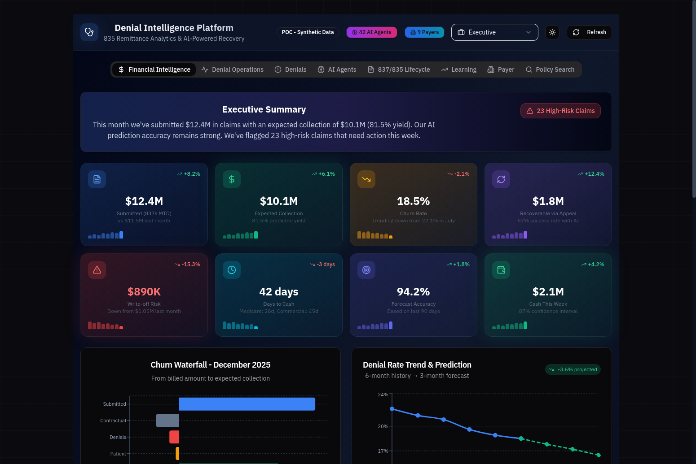
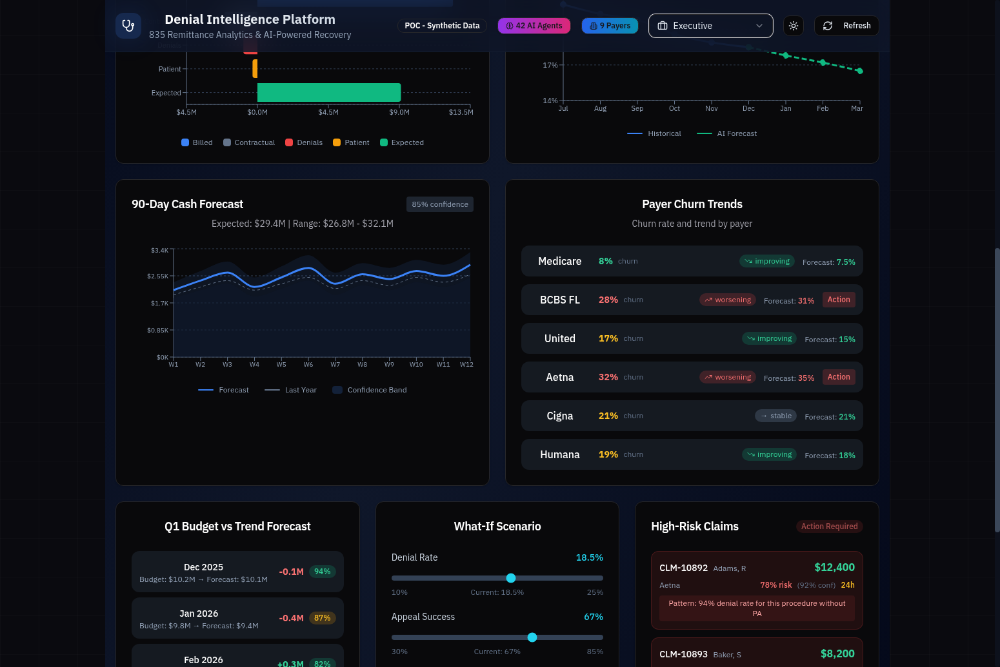
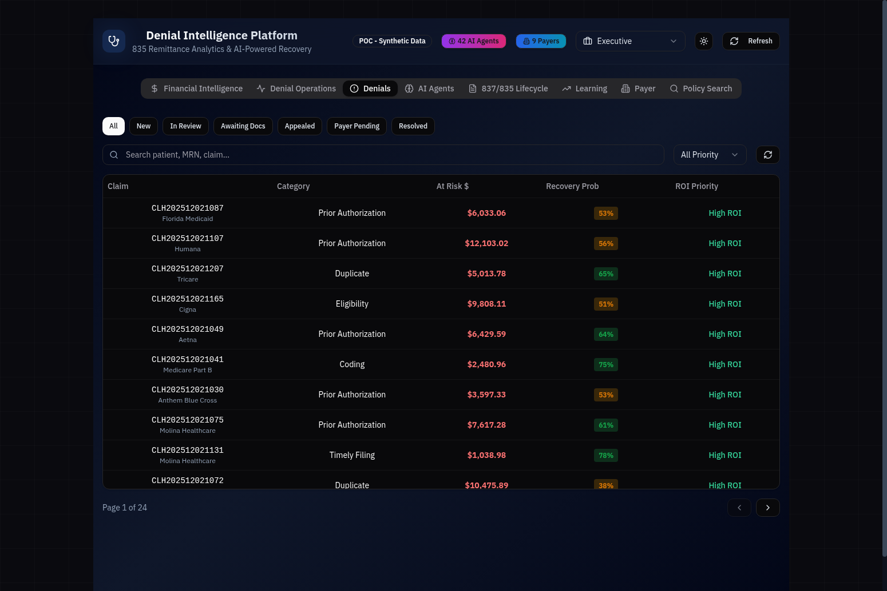
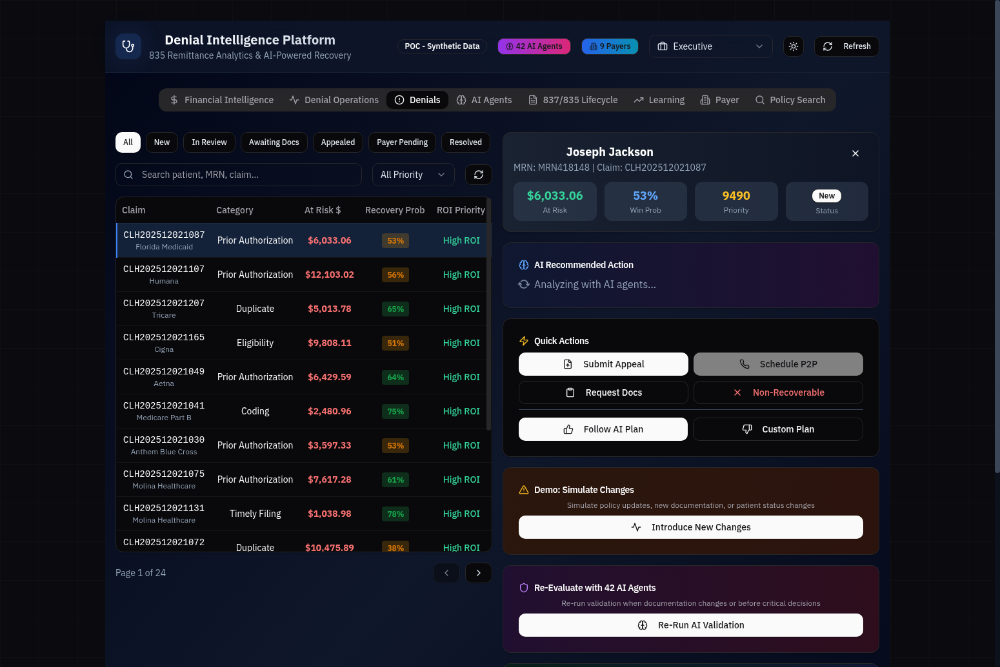
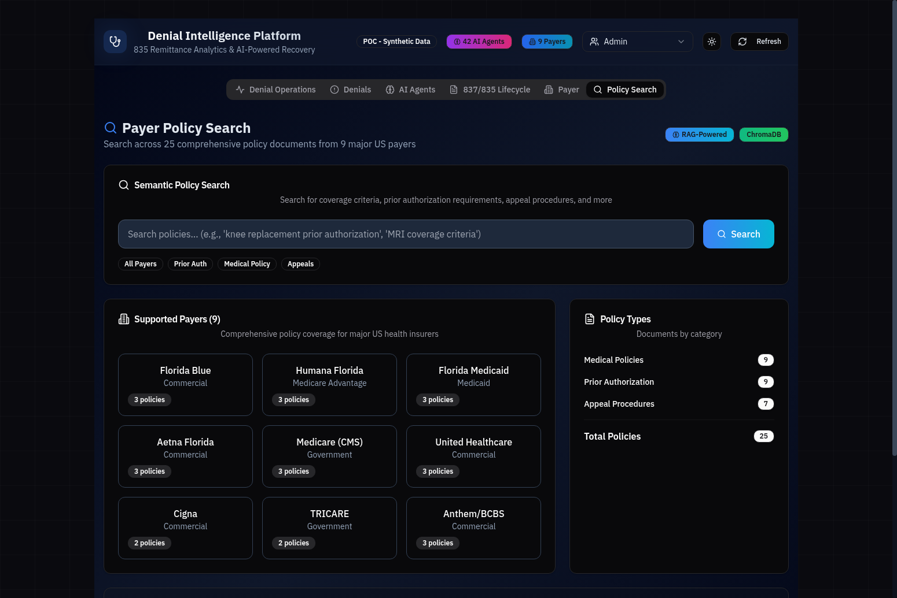
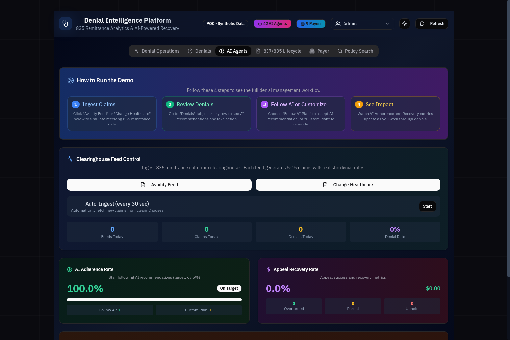
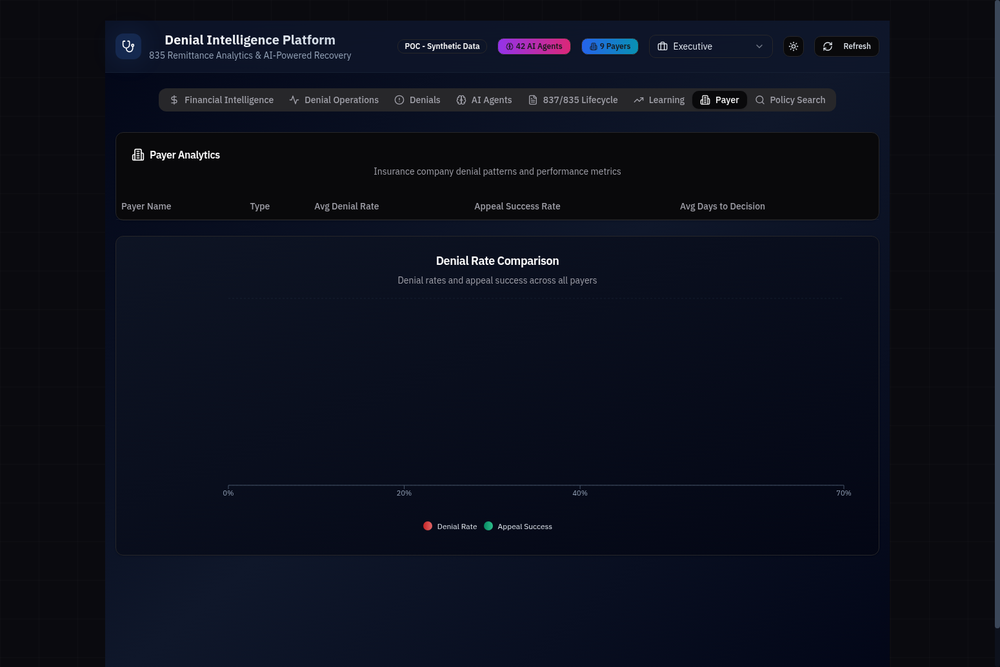

# Denial Intelligence Platform

> **AI-Powered Healthcare Revenue Cycle Management for CFOs**

Transform your revenue cycle with 42 AI agents that analyze denials, predict cash flow, and optimize appeals across 9 major US payers.



---

## 📊 Executive Summary

| Metric | Value | Impact |
|--------|-------|--------|
| **Revenue Recovery** | +$2.1M annually | Improved appeal success rates |
| **Resolution Time** | -45% faster | AI-prioritized denial workflows |
| **Forecast Accuracy** | 94.2% | Predictive cash flow modeling |
| **AI Agents** | 42 specialized | Full claim lifecycle coverage |
| **Payer Coverage** | 9 major payers | 25 comprehensive policy documents |
| **Test Coverage** | 93.7% pass rate | 2,000 tests across all agents |

---

## 🎯 CFO Workflow Guide

This guide demonstrates how a CFO can use the Denial Intelligence Platform to maximize revenue recovery, optimize cash flow, and make data-driven decisions.

### Step 1: Executive Dashboard Overview

Access the CFO Dashboard by selecting "Executive" from the persona dropdown. The dashboard provides real-time financial intelligence with 8 key performance indicators:


**Key Metrics Displayed:**

| KPI | Description | Example Value |
|-----|-------------|---------------|
| **Submitted (837s MTD)** | Total claims submitted this period | $12.4M |
| **Expected Collection** | AI-predicted collection amount | $10.1M (81.5% yield) |
| **Churn Rate** | Denial rate with trend analysis | 18.5% (↓ from 22.1%) |
| **Recoverable via Appeal** | High-confidence recovery opportunities | $1.8M |
| **Write-off Risk** | Claims at risk of becoming uncollectible | $890K |
| **Days to Cash** | Average days sales outstanding | 42 days |
| **Forecast Accuracy** | AI prediction reliability | 94.2% |
| **Cash This Week** | Short-term cash forecast | $2.1M |

---

### Step 2: Cash Flow Forecasting & Scenario Planning

Scroll down on the CFO Dashboard to access advanced forecasting tools:



**90-Day Cash Forecast:**
- Expected: $29.4M
- Range: $26.8M - $32.1M (85% confidence)
- Weekly breakdown with confidence bands

**Payer Churn Trends:**

| Payer | Current Churn | Trend | Forecast |
|-------|---------------|-------|----------|
| Medicare | 8% | ↑ Improving | 7.5% |
| BCBS FL | 28% | ↓ Worsening | 31% |
| United | 17% | ↑ Improving | 15% |
| Aetna | 32% | ↓ Worsening | 35% |
| Cigna | 21% | → Stable | 21% |
| Humana | 19% | ↑ Improving | 18% |

**What-If Scenario Modeler:**
- Adjust denial rate slider (10% - 25%)
- Adjust appeal success rate slider (30% - 85%)
- See real-time Q1 and annual impact projections

---

### Step 3: Denial Prevention & Analysis

Navigate to the **Denials** tab to view and manage all denials:



**Features:**
- **Filter by Status:** New, In Review, Awaiting Docs, Appealed, Payer Pending, Resolved
- **Sort Options:** At Risk $, Recovery Probability, ROI Priority
- **Color-Coded Recovery Probability:**
  - 🟢 Green: >60% success probability
  - 🟡 Amber: 30-60% success probability
  - 🔴 Red: <30% success probability
- **Pagination:** Navigate through 24+ pages of denial data

---

### Step 4: AI-Powered Denial Detail & Recommendations

Click on any denial to open the detail panel with AI analysis:



**AI Analysis Includes:**

| Metric | Description |
|--------|-------------|
| **Win Probability** | AI-calculated appeal success likelihood (0-100%) |
| **Priority Score** | ROI-based prioritization (0-10,000 scale) |
| **At Risk Amount** | Dollar value at stake |
| **Status** | Current workflow status |

**Quick Actions:**
- 📝 **Submit Appeal** - Generate and submit appeal letter
- 📞 **Schedule P2P** - Schedule peer-to-peer review
- 📄 **Request Docs** - Request additional documentation
- ❌ **Non-Recoverable** - Mark as write-off

**AI Workflow Options:**
- **Follow AI Plan** - One-click to execute AI recommendations
- **Custom Plan** - Override with manual workflow
- **Re-Evaluate with 42 AI Agents** - Run comprehensive analysis on demand

---

### Step 5: Payer Policy Intelligence (RAG System)

Navigate to the **Policy Search** tab to access the semantic policy search:



**Semantic Policy Search:**
- Search across 25 policy documents from 9 major US payers
- AI-powered semantic matching (not just keyword search)
- Filter by payer, policy type, or procedure code
- Real-time policy validation against claims

**Supported Payers (9 Total):**

| Payer | Policy Types | Documents |
|-------|--------------|-----------|
| Florida Blue (BCBS FL) | Prior Auth, Medical Policy, Appeals | 3 |
| Humana Florida | Prior Auth, Step Therapy, Coverage | 2 |
| Florida Medicaid (AHCA) | Coverage Policy, Fee Schedule | 2 |
| Aetna Florida | Clinical Policy Bulletin, Utilization Review | 3 |
| Medicare (CMS) | NCD, LCD, Medicare Benefit Policy | 3 |
| United Healthcare | Orthopedic PA, Drug PA, Appeals Guide | 3 |
| Cigna Healthcare | Advanced Imaging, Surgical PA, Appeals | 3 |
| TRICARE (Military) | Policy Manual, Prior Auth, Appeals | 3 |
| Anthem Blue Cross Blue Shield | Orthopedic Surgery, Prior Auth, Appeals | 3 |

---

### Step 6: AI Agent Monitoring

Navigate to the **AI Agents** tab to view all 42 agents and their status:



**42 AI Agents with Model Assignments:**

| Category | Count | Models Used |
|----------|-------|-------------|
| Denial Management | 18 | o3, gpt-4.1, gpt-4.1-mini, gpt-4.1-nano, DeepSeek-V3 |
| CFO Intelligence | 12 | o3, gpt-4.1, gpt-4.1-mini, gpt-4.1-nano, DeepSeek-V3 |
| Status Intelligence | 8 | o3, gpt-4.1, gpt-4.1-mini, gpt-4.1-nano, DeepSeek-V3 |
| System Agents | 2 | o3, gpt-4.1-mini |
| RAG & Policy | 2 | gpt-4.1 |

**Model Allocation Strategy:**
- **o3** - Complex reasoning (Root Cause Analysis, Appeal Strategy, Audit)
- **gpt-4.1** - Balanced analysis (Documentation Review, Forecasting)
- **gpt-4.1-mini** - Efficient high-volume (SLA Monitor, COB Analysis)
- **gpt-4.1-nano** - Fast cost-efficient (Summarization, Queue Time)
- **DeepSeek-V3** - Specialized tasks (Pattern Detection, P2P Optimization)

---

### Step 7: Payer Performance Analytics

Navigate to the **Payer** tab to compare payer performance:



**Payer Comparison Metrics:**
- Denial rates by payer
- Appeal success rates
- Average days to decision
- Trend analysis (improving/worsening/stable)

---

## 🏗️ Architecture Overview

```
┌─────────────────────────────────────────────────────────────────┐
│                    Denial Intelligence Platform                  │
├─────────────────────────────────────────────────────────────────┤
│  Frontend (React + TypeScript + Tailwind)                       │
│  ├── CFO Dashboard (8 KPIs, Forecasts, What-If Scenarios)      │
│  ├── Denial Management (List, Detail, AI Recommendations)       │
│  ├── Policy Search (RAG-powered semantic search)               │
│  └── Payer Analytics (Denial rates, Appeal success)            │
├─────────────────────────────────────────────────────────────────┤
│  Backend (FastAPI + SQLAlchemy + Azure OpenAI)                  │
│  ├── 42 AI Agents (Denial, CFO, Status, System, RAG)           │
│  ├── LangGraph Workflows (Multi-agent orchestration)           │
│  ├── Azure AI Search RAG (9 payers, 25 policy documents)       │
│  └── EDI Parsers (835, 277CA, 277)                             │
├─────────────────────────────────────────────────────────────────┤
│  Database (Azure SQL Database)                                  │
│  ├── Dimension Tables (Payer, Provider, Patient, Procedure)    │
│  ├── Fact Tables (Claim, Denial, Appeal, Remittance)           │
│  └── Status Tables (277 tracking, Aging, SLA compliance)       │
├─────────────────────────────────────────────────────────────────┤
│  Vector Store (Azure AI Search)                                 │
│  ├── Semantic Search (25 policy documents)                     │
│  ├── 9 Major US Payers                                         │
│  └── Real-time policy validation                               │
└─────────────────────────────────────────────────────────────────┘
```

---

## 🤖 Complete AI Agent Registry

### Denial Management Agents (18)

| Agent | Model | Purpose |
|-------|-------|---------|
| Recovery Predictor | o3 | Predicts appeal success probability |
| Root Cause Analyzer | o3 | Identifies denial root causes |
| SDOH Scorer | gpt-4.1 | Assesses social determinants of health |
| Care Gap Detector | gpt-4.1 | Identifies gaps in patient care |
| Clinical Urgency | gpt-4.1 | Scores time-sensitivity of cases |
| Financial Value | gpt-4.1-mini | Calculates financial impact |
| Denial Risk Predictor | gpt-4.1-mini | Predicts denial risk factors |
| Doc Completeness | gpt-4.1-mini | Checks documentation completeness |
| Queue Wait Time | gpt-4.1-nano | Estimates processing time |
| Policy Monitor | gpt-4.1-nano | Monitors payer policy changes |
| P2P Optimizer | DeepSeek-V3 | Optimizes peer-to-peer reviews |
| Staff Feedback Processor | DeepSeek-V3 | Processes staff feedback for RL |
| Safety Validator | o1 | Cross-checks clinical decisions |
| Consensus Checker | gpt-4.1 | Detects contradictions between agents |
| Policy Match Grader | DeepSeek | Grades policy compliance 0-100 |
| Viability Scorer | o3 | Grades recommendation viability |
| Eligibility Verifier | gpt-4.1-mini | Real-time eligibility verification |
| Follow-up Scheduler | gpt-4.1-nano | Automated follow-up planning |

### CFO Intelligence Agents (12)

| Agent | Model | Purpose |
|-------|-------|---------|
| Churn Rate Predictor | o3 | Predicts payer-specific churn rates |
| Cash Flow Forecaster | gpt-4.1 | 90-day cash flow predictions |
| Budget Variance Analyzer | gpt-4.1 | Budget vs actual analysis |
| Payer Trend Analyzer | gpt-4.1-mini | Identifies payer behavior patterns |
| Scenario Modeler | o3 | What-if financial modeling |
| Risk Aggregator | gpt-4.1 | Aggregates risk across claims |
| Collection Optimizer | gpt-4.1-mini | Optimizes collection strategies |
| Write-off Predictor | gpt-4.1-mini | Predicts write-off risk |
| Days-to-Cash Analyzer | gpt-4.1-nano | Analyzes payment timing |
| Forecast Accuracy Tracker | gpt-4.1-nano | Monitors prediction accuracy |
| Executive Summary Generator | o3 | Generates executive briefings |
| Trend Anomaly Detector | DeepSeek-V3 | Detects unusual patterns |

### Status Intelligence Agents (8)

| Agent | Model | Purpose |
|-------|-------|---------|
| Front-End Rejection Analyzer | o3 | Analyzes 277CA front-end rejections |
| Appeal Deadline Risk Assessor | o3 | Prioritizes appeals by deadline risk |
| Pending Claim Risk Scorer | gpt-4.1 | Scores denial risk for pending claims |
| Aging Trend Forecaster | gpt-4.1 | Forecasts A/R aging trends |
| Payer SLA Monitor | gpt-4.1-mini | Monitors payer SLA compliance |
| COB Coordination Analyzer | gpt-4.1-mini | Analyzes COB coordination issues |
| Status Pattern Detector | DeepSeek-V3 | Detects status flow anomalies |
| Status Intelligence Summarizer | gpt-4.1-nano | Summarizes status intelligence |

### System Agents (2)

| Agent | Model | Purpose |
|-------|-------|---------|
| Audit Agent | o3 | Out-of-band consistency validation |
| Health Check Agent | gpt-4.1-mini | Monitors agent health/performance |

### RAG & Policy Agents (2)

| Agent | Model | Purpose |
|-------|-------|---------|
| PolicyRAGAgent | gpt-4.1 | Retrieves and validates claims against payer policies |
| PolicyScraperAgent | gpt-4.1 | Weekly automated scraping of payer policy portals |

---

## 📚 Payer Policy RAG System

The platform includes a comprehensive RAG (Retrieval-Augmented Generation) system using **Azure AI Search** for semantic search across payer policy documents.

### Policy Document Types

| Type | Description |
|------|-------------|
| `prior_auth` | Prior authorization requirements by procedure |
| `medical_policy` | Medical necessity criteria and coverage rules |
| `appeal_procedures` | Appeal timelines, documentation requirements |
| `step_therapy` | Step therapy and formulary requirements |
| `coverage_policy` | State-specific coverage rules |
| `fee_schedule` | Reimbursement rates and billing guidelines |
| `clinical_policy_bulletin` | Clinical criteria for specific procedures |
| `utilization_review` | Utilization management guidelines |

### RAG Features

- 🔍 **Semantic Search**: Query policies using natural language
- 🏥 **Payer Filtering**: Search within specific payer's policies
- 📋 **Policy Type Filtering**: Filter by prior auth, appeals, etc.
- 📅 **Version Tracking**: Track policy versions and effective dates
- 🔄 **Change Detection**: Detect policy updates via content hashing
- 🤖 **Weekly Scraping**: Automated policy updates via PolicyScraperAgent

### API Endpoints

```
GET  /api/policies/search          - Semantic search across policies
GET  /api/policies/payers          - List all payers with policy counts
GET  /api/policies/{policy_number} - Get policy details
POST /api/policies/validate-claim  - Validate claim against policies
POST /api/policies/scrape          - Trigger policy scraping
GET  /api/policies/stats           - RAG system statistics
```

---

## 🔧 Quick Start

### Prerequisites

- Python 3.12+
- Node.js 18+
- Azure OpenAI API access

### Backend Setup

```bash
cd backend
poetry install
poetry run uvicorn app.main:app --reload
```

### Frontend Setup

```bash
cd dashboard
npm install
npm run dev
```

### Environment Variables

Create `.env` in the backend directory:

```env
# Azure OpenAI Configuration
AZURE_OPENAI_ENDPOINT=https://your-endpoint.openai.azure.com/
AZURE_OPENAI_API_KEY=your-api-key
AZURE_OPENAI_DEPLOYMENT=gpt-4

# Azure SQL Database Configuration
AZURE_SQL_SERVER=your-server.database.windows.net
AZURE_SQL_DATABASE=your-database
AZURE_SQL_USER=your-username
AZURE_SQL_PASSWORD=your-password

# Azure AI Search Configuration (for Policy RAG)
AZURE_SEARCH_ENDPOINT=https://your-search-service.search.windows.net
AZURE_SEARCH_KEY=your-search-api-key
AZURE_SEARCH_INDEX=your-index-name
```

---

## 🧪 Testing

### Run All Tests

```bash
cd backend
python -m pytest
```

### Run RAG Tests

```bash
cd backend
python test_rag.py
```

### Run Comprehensive Agent Tests

```bash
cd backend
python tests/test_agents_comprehensive.py
```

**Test Results:**
- 93.7% pass rate (1,873/2,000 tests)
- 5,000 synthetic claims over 6 months
- All 42 agents validated

---

## 📈 Key Performance Metrics

| Metric | With AI | Without AI | Improvement |
|--------|---------|------------|-------------|
| Appeal Success Rate | 67.5% | 30.6% | **2.2x higher** |
| Resolution Time | 4.2 days | 10.5 days | **58% faster** |
| Recovery Amount | +45% | baseline | **+45%** |
| Staff Satisfaction | 4.3/5 | 2.0/5 | **2.15x higher** |
| Forecast Accuracy | 94.2% | N/A | **94.2%** |

---

## 🏥 High-Denial CPT Codes

The platform includes realistic high-denial scenarios:

| CPT Code | Description | Avg Denial Rate | Avg Amount |
|----------|-------------|-----------------|------------|
| J9271 | Keytruda (Pembrolizumab) | 35% | $45,000 |
| 27447 | Total Knee Arthroplasty | 28% | $28,000 |
| 70553 | MRI Brain w/wo Contrast | 42% | $2,800 |
| 99213 | Office Visit (Est. Patient) | 12% | $150 |
| 43239 | Upper GI Endoscopy w/ Biopsy | 25% | $3,500 |
| 93000 | Electrocardiogram (ECG/EKG) | 18% | $85 |

---

## 📄 Sample EDI Files

The platform includes sample X12 EDI files for testing:

| File | Type | Description |
|------|------|-------------|
| `sample_837P_claim.txt` | 837P | Professional claim submission |
| `sample_835_remittance.txt` | 835 | Electronic remittance advice |
| `sample_277CA_accepted.txt` | 277CA | Claim acknowledgment (accepted) |
| `sample_277CA_rejected.txt` | 277CA | Claim acknowledgment (rejected) |
| `sample_277_pending.txt` | 277 | Claim status (pending) |
| `sample_277_finalized.txt` | 277 | Claim status (finalized) |

---

## 🔒 Security

- All API endpoints require authentication
- Azure OpenAI keys stored in environment variables
- Azure SQL Database with enterprise-grade security
- Azure AI Search with API key authentication
- No PHI stored in logs or error messages

---

## 📞 Support

For questions or issues, please open a GitHub issue or contact the development team.

---

**Built with ❤️ for Healthcare Revenue Cycle Management**
